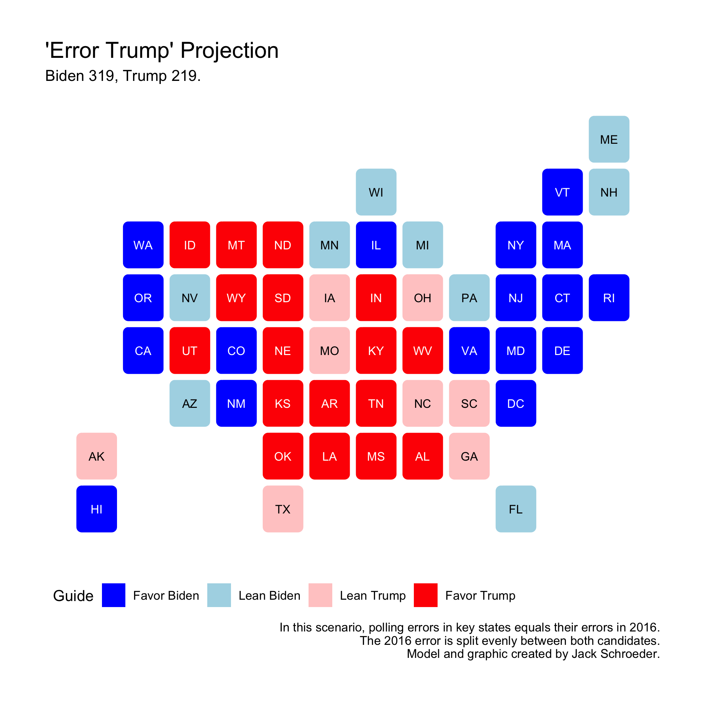
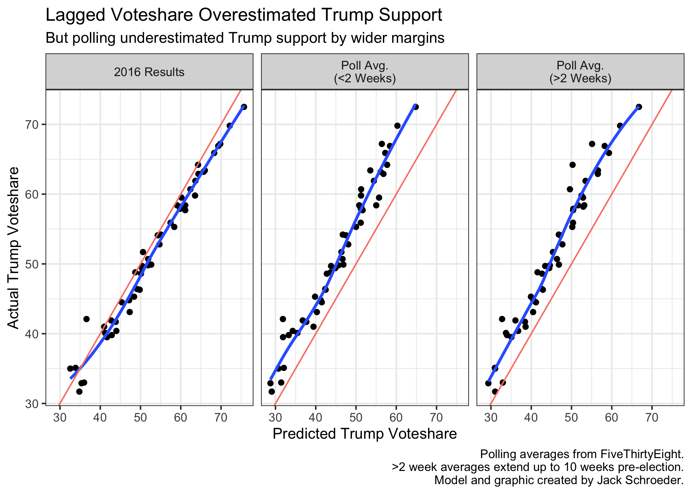

## Post-Election Reflection (11.22.20)

### A Primer

Now that the 2020 election is (mostly) behind us, it’s time to evaluate my model and its components. In this post, I’ll be answering the following questions:

(1) What exactly was my model, again, and how did it do? (The random forest regression performed better than expected, but still room for improvement!)

(2) Is there anything to learn from my alternate specifications? (Previous error is worth considering, but take it with a grain of salt.)

(3) Where did my predictions/predictors go wrong, and can I quantitatively test these beliefs? (I have some theories that may be testable.)

With that in mind, let’s proceed to a quick model recap:

### Model Recap

My final model was a random forest regression predicting each party’s two-party voteshare in each state.

**What is a random forest?** It is a regression/classification technique based on decision trees (think: flowcharts). A single decision tree is prone to overfitting the sample data and inaccurately predicting future outcomes. Random forests try to avoid these issues by forming many trees, each with a random sample of the data and only a handful of the predictors. The model averages each tree’s prediction and spits out a final point estimate. Each party had its own model, which predicted a two-party voteshare estimate for each state. I took the predicted voteshare for each party in each state to get a final two-party voteshare estimates.

**What did I feed into the model?** Throughout class, we worked with many different sources of data. I ended up with eight predictors: polls (two-week and ten-week state polling averages), fundamentals (annual national GDP growth, annual local state unemployment, presidential approval, and a dummy variable for incumbent party), and lagged variables (2016 national and state voteshares). Since each tree had a random sample of data, each variable had to have complete data. This kept me from using data pre-1980.

**Is the model any good?** Historically, the party models average out to a root mean square error of **3.02 percentage points**. What does this capture? This is the in-sample error of the model’s predictions. However, due to the random sampling of data within each tree, this number also helps account for out-of-sample error, since each tree only had access to a subset of the overall data.

**What was the prediction?** As the visual below shows, I predicted a healthy Biden victory of 334 electoral votes to Trump’s 204. There were seven states within the historical error (in order of predicted Trump support): Arizona, Florida, North Carolina, Georgia, Ohio, Iowa, and Texas.

**How did it do?** Not bad at all. It got three states wrong: Florida, North Carolina, and Georgia. The model missed Florida by more than the historical error (it was 3.9 points off). North Carolina was a bit closer at 2 points off. Surprisingly, Georgia was tied for the fourth-closest state, with the predicted estimate only being off by 0.3 points. Overall, the model had an **RMSE of 2.966**. That number drops to 2.856 when New York is excluded due to incomplete results that currently favor Trump. Either way, the RMSE outperforms the original RMSE of 3.02, which is pretty unexpected for an election said to be hard to predict.

**How does this error look?** A simple plot of the error is below. One fun outcome: Virginia, with a predicted Trump two-party voteshare of 44.8%, was *accurate down to the tenths place*! Overall, the model missed low on Trump support, particularly where he was projected to be strongest.

Before dissecting this error, though, I want to go over one of the alternate scenarios from my final prediction:

### Scenario Planning

Before the election, I outlined some other specifications of the model. Some of these changed components in the model, but most relied on changing the prediction inputs for 2020. In one of these, I adjusted polling averages in swing states by the 2016 polling error. I ended up with the following prediction:

Why bring this up? This prediction did *better* than my prediction above. It only got two states wrong (Florida and Georgia) and had an RMSE of 2.911 (down to 2.788 without New York).

Intuitively, this makes sense. There were many polling skeptics this year who believed that underlying problems hadn’t been addressed. I’ll deal more with polling later, but this result is interesting but not necessarily important. As Silver (2020) notes, polling error tends to swing unpredictably between elections. Much like how generals tend to fight the previous war, it probably isn’t the best move to predict the same election by adjusting for previous error. That said, if you have reason to believe this error is endemic to polling and will persist, prior error will be vital to modeling going forward. More on this later.

### Prediction Hypotheses

Needless to say, there is a lot to unpack from this election. What I want to do from here is offer some hypotheses as to where and why my model was wrong and propose or conduct tests to evaluate those beliefs.

Two hypotheses arose from looking at prediction error:

H1: *Disparities in political geography led model error to be geographically distributed, with higher error in the Southeast.*

Certain predictors may have had geographic quirks that resulted in bad predictions. For instance, pollsters may have systematically undercounted certain voters in Midwestern states or misjudged demographic intentions in the Southeast.

H2: *Increases in polarization led model error to be ideologically distributed, with higher error for redder states.*

It may be the case that the country is getting more polarized, with red states trending redder and blue states trending bluer. The model may not have been able to account for this if the trend increased since 2016.

Both of these hypotheses can be initially tested through visuals.

To begin evaluating H1, I plotted RMSE by state:

There does not appear to be any geographic basis for saying any region had sizably more error than another. The model’s incorrect states were consolidated in the Southeast, but the largest root square errors aren’t found there. As mentioned above, North Carolina was largely in line with other errors, and the Georgia point estimate was within half a percentage point of the actual result.

Another region with a seemingly large polling error - the Midwest - doesn’t seem to have abnormally high model error. Predictions of Minnesota, Pennsylvania, and Michigan were all within three points of reality.

Instead, states like West Virginia, Oklahoma, and New York (due to incomplete data) had the largest error, and there doesn’t seem to be any particular region that’s error-prone.

Still, I can’t entirely discount H1. To evaluate it further, I would look to regress error on geographic area (probably the Census designations) along with other variables to account for other factors. I wouldn’t anticipate needing any more data than what I currently have to conduct this analysis.

To start testing H2, I plotted error on predicted winner:

Based on the graphic, H2 appears to have merit. The average predicted Republican state had a higher error than the average predicted Democratic state, even though there were more predicted Democrat misses (Florida and North Carolina) than predicted Republican misses (Georgia).

However, this doesn’t fully answer the question, since the visualization doesn’t convey how red and blue these states were. I’d want to dive deeper by analyzing state “stickiness” - how often it votes for the same party - and see whether that is correlated with prediction error. If that’s the case, I could also run regressions here to account for other factors. My guess is consistent with H2: sticky red (and, to a lesser extent, sticky blue) states likely have higher prediction error.

From a preliminary judgement of both hypotheses, it seems that H2 is stronger. However, H1’s focus on political geography may strengthen H2 going forward. Rodden (2019) notes how changes in political geography - specifically urban/rural divides - augment polarization and result in the inefficient distribution of Democratic voters across states, leading there to be more red states than blue. Due to this imbalance in political geography, this would result in the average state (and the Electoral College tipping point) trending redder than the nation as a whole.

### Predictor Hypotheses

Until now, I’ve been focusing on the model *predictions* and leaving aside the individual *predictors*. That changes here.

To ground this discussion, here is a plot of each predictor’s relative importance within the random forest model. Remember that each decision tree within the random forest has access to a subset of predictors. What this plot measures is which predictors trees leaned on more often when given access to them. These are relative values, though - variables with the highest importance were not available to every tree - and were calculated for each party model.

Three implications here:

(1) The three most important predictors are the polling averages and lagged state voteshare. There is variation in relative importance for these predictors between models. This isn’t necessarily bad, though, since it justifies my choice to choose party-based models.

(2) The only variable with a significant difference in relative importance is lagged state voteshare. This could be a testament to the relative stickiness of blue states, which deserves further exploration.

(3) The “fundamental” predictors were all substantially less important to the model than the polling averages and lagged state voteshare. It was widely assumed that the pandemic would make 2020 a bad year for fundamentals-based forecasts, but it appears that the random forest model treated these variables as subordinates when possible.

That doesn’t mean the fundamental variables are unimportant. In fact, the economic indicators in particular inspire two more hypotheses:

H3: *Economic variables underestimated Trump support because across the board, voters didn’t “blame” him for the economic crisis.* This assumes that voters held largely similar views on the economy that, if measured, could have reduced the underestimate.

H4: *Economic variables underestimated Trump support because in red states, voters didn’t “blame” him for the economic crisis.* This assumes that Trump’s supporters were likelier to give him a pass on the economy. The distinction here is crucial because of the model’s aforementioned undercounting of Trump support in deep red states.

To evaluate these claims, I would need access to economic approval ratings. I’m aware of certain questions asked to voters on whether they blamed Trump for the pandemic, but I don’t know if questions of blame are historically available. If they are, I’d run my models again with economic approval ratings included to gauge whether this would have any effect.

Now, let’s look at the most important components of the model: polls and lagged state voteshare. I’ve plotted the 2020 results against the predicted values of lagged state voteshare and the polling averages (sub-2 week and up-to-10 week):

Quite simply, it appears that the polling averages underestimated Trump support relative to 2020 results and (predictably) the lagged state voteshares overestimated Trump support. These patterns appear to be fairly linear, although lagged state voteshare flips to underestimating Trump in heavily blue states (this may be noise because of New York’s incomplete data).

There isn’t much reason to hypothesize about 2016 state voteshare on its own, but I have two on lagged voteshares more generally:

H5: *Including statewide voteshares from midterm elections would decrease the model’s reliance on polling averages.*

The rationale for this is that midterm results give a concrete example of electorate shifts that could help mitigate systematic polling error. On the other hand, midterm elections could overexaggerate anti-incumbent sentiments in many states, leading to inaccurate predictions.

To evaluate H5, I’d need midterm election data (preferably by state). It would also be useful to have demographic/party ID data from exit polls to help account for turnout swings for certain groups. The quantitative test would be as simple as adding this component to the model and running it again.

H6: *Including more lagged voteshares from general elections would reduce model error.*

Running averages of voteshares from the past few elections may help reduce the noise of any one election. This is similar to FiveThirtyEight’s “partisan lean” variable.

I wouldn’t need any additional data to evaluate H6, since we have popular vote tallies by state going back well past 1980.

That brings us to polling. There is a lot of doubt in the polling industry, especially after the seemingly high-profile misses like Florida. Downballot polling seemed to fare pretty badly this election, but I’d argue that polling averages performed pretty decently in the general. Below, I’ve plotted polling averages as they transition closer to the actual results:

As the graph shows, polling was rather steady leading up to the election. Indeed, the largest changes came in heavily red states trending more toward Biden within 2 weeks of voting. The actual results, however, leaned more toward Trump than the averages suggested. Put more succinctly, Trump tended to overperform his polls.

I have three hypotheses to help gauge why polls tended to miss Trump support more than that for Biden:

H7: *Polling averages (and individual polls) missed certain outcomes due to higher response rates among Democrats during the pandemic.*

Druke and Silver (2020) say that Democrat response rates went up during the pandemic because knowledge sector jobs (which lean Democratic) went virtual. I think this is a very interesting development, but I’d need access to polling response rates to accurately judge H7. If I had the data, I’d run a linear regression to see whether party ID was significant in predicting response rate.

H8: *Polling averages (and individual polls) missed certain outcomes due to systematic undercounting of Trump supporters, with reasons ranging from non-response bias to herding.*

I mentioned the “shy Trump voter” theory in my final prediction post. Many believe that position has become stronger post-2020, and some believe it operates independently of Trump through lower rates of social trust among Republican voters. To judge H8, I’d need the same data on polling response rates as H7 and information from polling agencies on how they weigh to see if they were potentially herding. I’d learn toward using linear regression as described in H7 here, but the analysis would have to take many more potential factors into account to prove systemic bias.

H9: *2020 followed a pattern of incumbents overperforming their polls when their approval ratings are low.*

This hypothesis differs from the others in trying to find historical backing for the polling miss. Most of the conversation is focused on 2020’s relation to 2016, but a better comparison may be 2012, where Barack Obama overperformed his polling averages in certain states even though his approval was not great. To test H9, I’d need to consolidate the data I currently have on polling averages and statewide results to test whether incumbents tend to overperform their polls (especially when their approval rating is low).

Finally, I want to propose a hypothesis on undecided voters:

H10: *Polling averages were stable pre-election because voters overestimate the certainty of their voting preference when an incumbent is running for re-election.*

As I noted in my final blog post, Jacobson (2020) finds that the number of undecided voters was particularly high in 2016 but on course to be fairly low in 2020. There could be an exogenous factor that made people change their mind, such as more salient campaign messaging. However, it could also be the case that an incumbent on the ballot biases voters toward reporting they have already made up their minds when they are still subject to change. Since they have been forming opinions on the candidate for the past four years, they may overstate their confidence in their vote preference.

To test H10, I’d more rigorous polling data that showed the percentage of undecided voters over several elections. The data would have to stretch back rather far to get a large enough sample of incumbents running for re-election. The initial evaluation would be a descriptive analysis comparing the number and trend of undecided voters and polling error in the incumbent’s favor.

I think these ten hypotheses can help ground future analysis of the 2020 election and help account for potential errors not just in my models, but in the election analytics industry more generally.

### Takeaways

I have a few conclusions from this whole process and how I’d change the model for future elections:

(1) Random forests can be **black boxes**. I used the `caret` library in R, which was easy to use but harder to strictly evaluate. I think it was serviceable for this election (it gave me good summary statistics), but in the future I’d be willing to work harder on coding the model if it meant I could see more of what was happening under the hood and make changes as needed.

(2) The model didn’t predict **Maine and Nebraska’s congressional districts** separately because of a lack of reliable historical data. That is tougher to fix, but in the future I’ll try harder to include them. If the trend of close elections continue, they could become pivotal.

(3) I can conduct more **historical backtesting** in the future. One part of this would be explicitly conducting leave-one-out cross validation to make sure the model’s random sampling of data are corresponding to out-of-sample accuracy.

(4) If I wanted to devote more attention to the model, I could be much more **rigorous about the polling inputs**. Instead of relying on FiveThirtyEight adjusted averages, I could switch to RealClearPolitics (a much simpler average) or create my own with raw polling data. While there are definitely concerns about reputability of certain pollsters - and those will only increase as pollsters attempt to adjust for the next election - a simple average helps guard against groupthink. Testing simple versus adjusted averages would be crucial here.

(5) Random forest models are very useful when there are a **bunch of predictors**. Eight was enough for me to be satisfied with the model, but it is much stronger when there are many more. Keeping in mind potential correlations between predictors, I want to find more variables to include for the next cycle (like economic opinion polling and partisan lean).

(6) There are a few **pie-in-the-sky changes** that could be made: *weighing polls* based on historical accuracy or time until election, incorporating *betting market data*, transitioning to a *probabilistic model* that randomly samples turnout, or creating an *ensemble model* that includes random forest and other techniques, etc.

### Conclusion

TL;DR - The model surprisingly performed better than expected, but there’s definitely room for improvement going forward. Ultimately, 2020 is shaping up to be a more complex election than 2016, but I’ve hopefully set the groundwork to help explain what analysts got wrong.

### References

Druke, G. and Silver, N. (2020, Nov. 12). “How the pandemic might have affected the polls in 2020.” *FiveThirtyEight*. Accessed online.

Jacobson, L. (2020, Nov. 1). "Why is 2020 not like 2016? Fewer undecideds, for one." *The Tampa Bay Times*. Accessed online.

Rodden, J. (2019). *Why cities lose: The deep roots of the urban-rural political divide.* Basic Books.

Silver, N. (2020, Oct. 31). "Trump can still win, but the polls would have to be off by way more than in 2016." *FiveThirtyEight*. Accessed online.