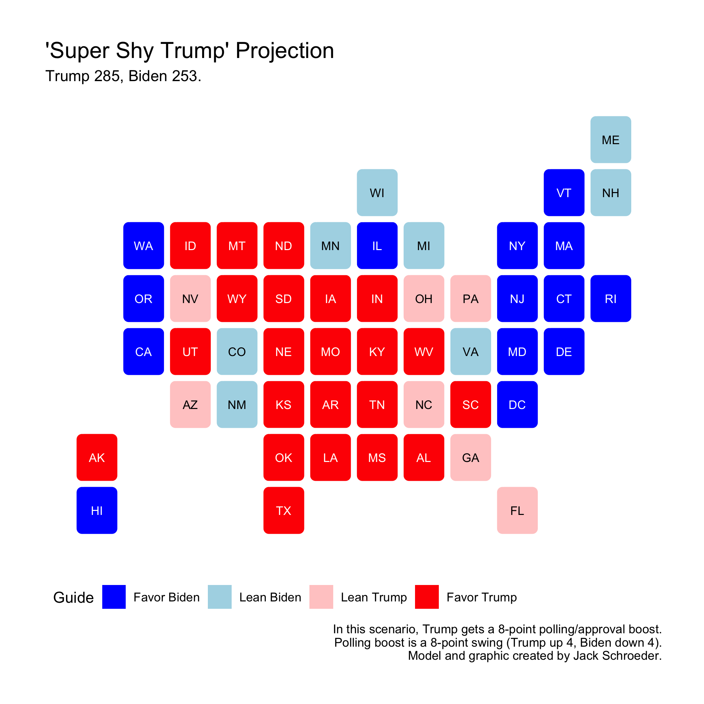
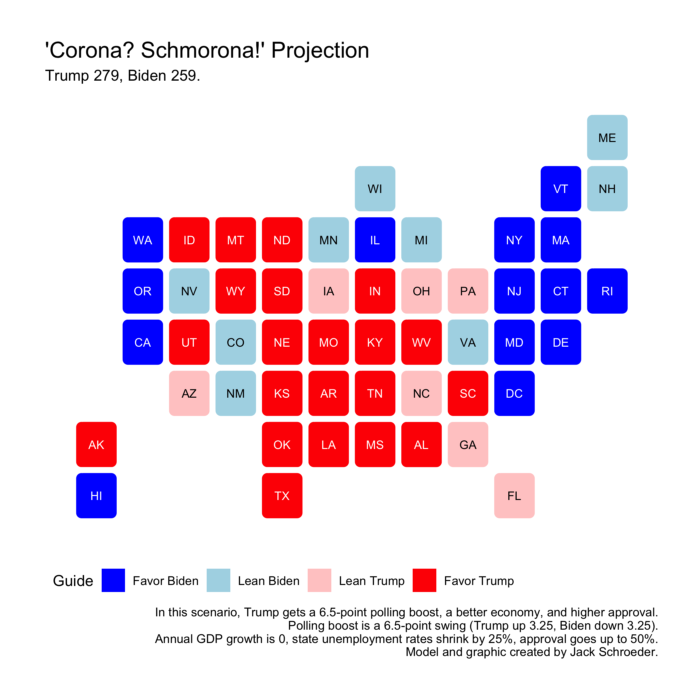

## Final Prediction (11.1.20)

### A Primer

### Initial Attempts

### Random Forests

### Modeling 2020

### Other Scenarios

### Conclusions

### References

Allcott, H., et al. (2020). "Polarization and public health: Partisan differences in social distancing during the coronavirus pandemic." *Journal of Public Economics* 191. November 2020. Accessed online.

*The Atlantic*. (2020). "The COVID Tracking Project." Updated October 23, 2020. Accessed online.

Vavreck, L. and Warshaw, C. (2020, September 18). "How local Covid deaths are affecting vote choice." *The New York Times.* Accessed online.
