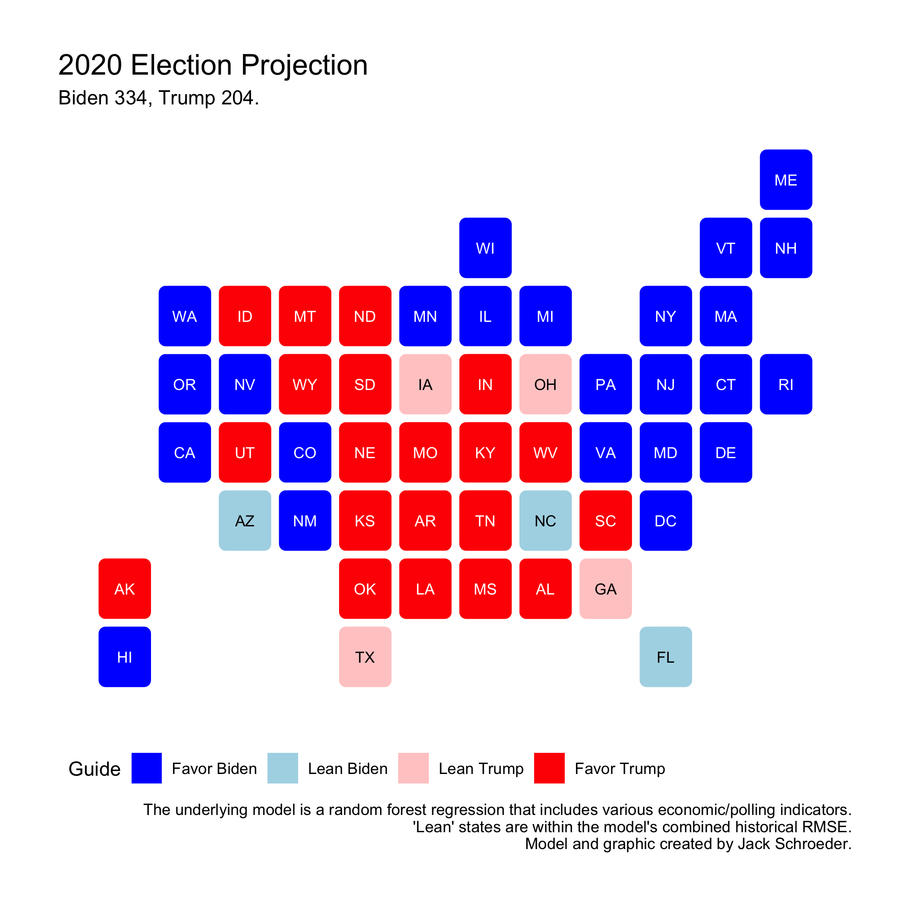

## Final Prediction (11.1.20)

### A Primer

The election is days away, and the time has come to unveil my final model. This was an intensive process - many iterations of data wrangling, models, graphics, scenarios, etc. I had a few questions in mind going into this final exercise:

(1) Who will win the election? (Likely Biden.)

(2) Can I create a model similar to the binomial logit used in class? (Not a good one.)

(3) Is there another way for me to model without resorting to simple linear regression? (Yes.)

(4) Do I have faith in this model? (Yes.)

(5) Are there other scenarios I can use to test my assumptions? (A bunch.)

With that in mind, I’ll outline how I got to my model, detail that model, give my prediction, and go through a few alternate scenarios.

### Initial Attempts

[Earlier this fall](../Posts/week5.md), I tried and failed to create state-based models that could predict 2020 in a reasonable way. Even when I was able to code the binomial process, I found that my model was way too bullish on Biden’s prospects when translated into margins of victory, so I decided to go descriptive for that week’s blog post and move on.

I always intended on coming back to this, though, and I did for a few days earlier this week. I ran into a few problems:

(1) My base linear model was overfitting and spitting out landslide results.

(2) I was still having trouble looping the binomial logit for each state.

(3) While I understood how the model introduced uncertainty in turnout by drawing off a binomial distribution, I wasn’t sure how to improve what had already been done in section.

Overall, I wanted to see if there was another way to model the election that improved on the faults of simple linear regression. Since it seemed like the rest of the class was building relatively similar models, I thought it could be useful to approach the task differently. This brought me to random forests.

### My Solution: Random Forests

I was first introduced to random forests by my TF in Prof. Chetty’s Ec 1152 class my sophomore spring. The concept builds off of decision trees, which should sound familiar. Let’s say you wanted to figure out what fruit I was holding. You could ask me whether it was red. That question (or rather the outcome of that test) is a node on this tree, and each branch corresponds to each potential outcome. On the red branch, you may ask if the fruit is used to make cider, since you already know it’s red. On the not red branch, your best guess may be to ask another color question to help narrow things down. There are different ways to structure the tree’s nodes and choose which variables (color, size, etc.) to ask about, but the general concept is simple.

The problem with using a single tree is that it’s liable to overfitting. A tree could be constructed to perfectly fit the data if the number of nodes is unrestricted. Trees on their own are also very sensitive to noisy data.

Random forests help by increasing the number of trees (hence the name). Each individual decision tree is trained on a different sample of data and uses a random subset of predictors (to decrease overfitting), increasing the diversity of the whole. The outcome in question is determined by averaging the results of all of these decision trees. This method is particularly useful for state models (instead of a national model) because of the increased amount of data, which allows trees to use a wide variety of samples and predictors.

With that in mind, I decided to try it out on the election data I’ve compiled. Since the technique randomly selects predictors, I eliminated any other outcome variables in my dataset, which wouldn’t be useful in predicting 2020 outcomes anyway. I justified the inclusion of each variable by only selecting those I had used before in previous models. The one variable I added was presidential approval, and that was because I assumed that the random forest procedure would benefit from having an additional predictor to use. I created separate models for each party, both with the same formula:

$$ State Two-Party Popular Vote Share ~ Lagged State 2P Voteshare + Lagged National 2P Voteshare + (Within) 2-week Polling Support + (Up to) 10-week Polling Support + Annual GDP Growth + Annual Local Unemployment + Presidential Approval + Incumbent Party $$

Since random forest regression is itself an ensemble model, I can’t display coefficients for the model. Also, I did not specify the weights for each tree because that would defeat the purpose. Instead, I can visualize the relative importance of each variable. These values are all relative - you shouldn’t compare these across other specifications - but they provide insight into which variables factor more into the prediction. The results for my models are below:

As expected (and seen before), lagged vote share, 2-week support, and 10-week support factor the heaviest into the model’s performance. I’m not worried that economic factors lag behind because it is a strange year for the economy and generally speaking, other models tend to put less weight on economic fundamentals as the election nears (such as Silver 2020).

### Model Comparison and Validation

There were a bunch of other ways to specify the model that also made sense. I used two-party voteshare as the outcome variable, but using the unscaled voteshare was also a possibility. I also created models that predicted overall votes per party, models based on incumbency rather than party, and a unitary model to predict two-party voteshare for both candidates.

I used a familiar metric (root mean square error) to compare the models’ performance, which the table below visualizes. Since random forests already proxy out-of-sample validation within each tree through the bootstrapping process, I focused on this in-sample validation to select a model.

A few takeaways:

(1) The main goal was to beat the original linear state-based model, which all of the specifications did.

(2) The incumbency-based and raw vote models didn’t perform great relative to the other models. The unitary model was competitive, but three of the specifications beat it, and conceptually, it makes more sense to individually model for each candidate.

(3) The incumbency-based models didn’t perform great relative to the other models, but the unscaled popular vote models had a better RMSE than two-party models. Why, then, did I choose the two-party model?

It boils down to the nature of the 2020 race. Unscaled popular vote total would be very useful if we expected to see a spoiler candidate. With respect to Jo Jorgensen, third parties don’t seem to be a major factor in the race.

Another use could be to model undecided voters. I initially thought that using unscaled voteshares could shed light on undecided voters. I was wrong for two reasons. First, Jacobson (2020) notes that the number of undecided voters is particularly low in this race. Second, even if I wanted to gauge differential values in undecided voters, it would be better to do that with a predictor rather than the outcome variable. Indeed, as the graph below shows, my model can help with this by having two separate polling averages at different points in the race. Since the number of unaligned poll respondents (undecided voters or third-party voters) goes down dramatically over the course of campaigning, I felt confident in using two-party voteshares to curtail the influence of outlier elections like 1992.

### 2020 Prediction

With all of that background in mind, I can now reveal my 2020 prediction. The map below details the winner of each state, along with a degree of certainty. Any state with a candidate projected to win by 10 points (well outside the average error - proxied by RMSE - of the models) is favored, any state within 10 points (two-party voteshares between 45-55) is leaning one way or the other.

The conclusions:

(1) Biden appears *likely* to beat Trump, getting 334 electoral votes from my two-party voteshare models. The most important swing states - Pennsylvania, Florida, Arizona, etc. - lean in his direction (although by less than four points), along with others like Wisconsin, Michigan, and North Carolina.

(2) This map could look worse for Trump - he is favored in Georgia and Texas (by less than two points in both) - but his leads in states like Alaska, Missouri, and South Carolina are narrower than expected.

(3) I’m happy I got the `statebins` look to work, but this map could better represent the uncertainty around the outcome. Even if I treated each model individually, the Republican model has an RMSE of 3.14 points, which represents a sizable swing on its own. **Trump is not out of this fight.** If one sees the error of this model as simply the RMSE of both models combined - I know this isn’t accurate, but it’s useful for explaining this - **seven states are within this additive margin of error alone**: Texas, Iowa, Ohio, Georgia, North Carolina, Arizona, and Florida (who combine for 133 electoral votes).

(4) I could devote pages to the limitations of this model, but chief among them is not dynamically modeling turnout in face of early voting/the pandemic. Another worth mentioning quickly is that this model can’t predict any factors happening outside of the voting process, such as how those votes are counted, which votes may be thrown out, etc. I’d be much more comfortable with the model’s limitations in a different cycle, but since we live the world 2020 has given us, I’m *very* cautious about talking up the strength of my model. A major takeaway from this class is that **uncertainty is OK** in forecasting.

### Other Scenarios

I wanted to explore some possible scenarios and an alternate universe where the pandemic wasn’t as bad. To do this, I made changes to some of the predictors (polling averages, approval, economic indicators) before they were fed into the model. These aren’t meant to be definitive by any means - they’re just for fun. Here they are!

#### Shy Trump

First up is lending some weight to the “shy Trump voter” theory, which asserts that Trump support is systematically undercounted due to social desirability bias or non-response bias. The theory sounds promising at first glance, but as Silver (2020) notes, there doesn’t seem to be a uniform effect of this on electoral outcomes. Whatever the case, I decided to indulge the theory’s proponents and model based off of a four-point polling swing (Trump’s numbers up 2, Biden’s down 2) and approval boost to see how it would impact the predicted outcome:

Biden still edges out a victory on this map, but the result is anything but certain. Every swing state is still in play: Trump wins North Carolina, Florida, and Arizona by less than a point, and Biden carries Pennsylvania, Nevada, and Wisconsin by less than two. With the expected error, this is a much more open map than before - 9 states within the combined margin described above (GA, NC, FL, AZ, PA, NV, WI, MI, MN).

#### Super Shy Trump

I could go even further with the Trump boosters - a uniform eight-point swing in the polls and boost in the approval rating. This one is purely for fun purposes - it’s *very, very, very* unlikely the polls are anywhere this wrong.

The map shows a Trump victory (but not one as big as 2016). Ten states are within that margin: AZ, FL, PA, NV, WI, MI, MN, NH, VA, and CO. Again, this outcome would be extremely, extremely unlikely.

#### Same Errors as 2016

The two above scenarios are both pretty unlikely and unscientific. Instead of having a uniform error across the board, what if each swing state was off exactly the same way since 2016 (polling errors from Silver 2020)? This isn’t likely - pollsters have made lots of changes and errors are, to a certain extent, random - but here are the results:

Biden still gets a sizable victory here. This is pretty similar to Silver (2020)’s results (which were just added to the vote shares post-model). Interestingly, Maine is now within the margin, along with some of the usual suspects (TX, NC, GA, WI, FL, PA, AZ, MN, and MI).

#### Pandemic-Lite (Corona? Schmorona!)

Finally, let’s maneuver over to a world with a much more subdued coronavirus (or a better handling of it). Trump receives a 6.5-point polling swing in his favor, GDP growth is 0 (still not great, but definitely better than the alternative), state unemployment rates shrink by 25% (lighter recession), and approval goes up to 50% (which was at least a possibility pre-pandemic).

Trump gets the nod in this map, but it’s pretty close. Pennsylvania is within half a point, and there are nine other states within the margin (AZ, FL, NV, WI, MN, MI, NH, VA, and CO). This implies that Trump wasn’t exactly invulnerable before the virus; even if the handling had gone better and certain indicators swung his way, the election would still look to be very competitive.

### Final Thoughts

Where does this leave us? **I’m picking Biden to win, but don’t count Trump out.** Uncertainty is king, especially in 2020, and numerous states look to be in play. While I’m proud of my model, I recognize its limitations, especially in a post-2016 world where much of the country is still scarred by state-specific polling error. Biden has many factors going for him: good polling, a lagging economy, low incumbent approval. That said, my model indicates that lagged state voteshare is about as important as polling averages, and Trump’s broad victory in 2016 may help him hold on in key states. Outside of that, other factors outside of my model could play a large role in deciding the outcome.

The verdict? A betting man would put money on Biden, but a smarter man would save that money and invest it elsewhere. People can be hard to predict.
### References

Allcott, H., et al. (2020). "Polarization and public health: Partisan differences in social distancing during the coronavirus pandemic." *Journal of Public Economics* 191. November 2020. Accessed online.

*The Atlantic*. (2020). "The COVID Tracking Project." Updated October 23, 2020. Accessed online.

Jacobson, L. (2020, Nov. 1). "Why is 2020 not like 2016? Fewer undecideds, for one." *The Tampa Bay Times*. Accessed online.

Silver, N. (2020, Oct. 31). "Trump can still win, but the polls would have to be off by way more than in 2016." *FiveThirtyEight*. Accessed online.

Vavreck, L. and Warshaw, C. (2020, September 18). "How local Covid deaths are affecting vote choice." *The New York Times.* Accessed online.
