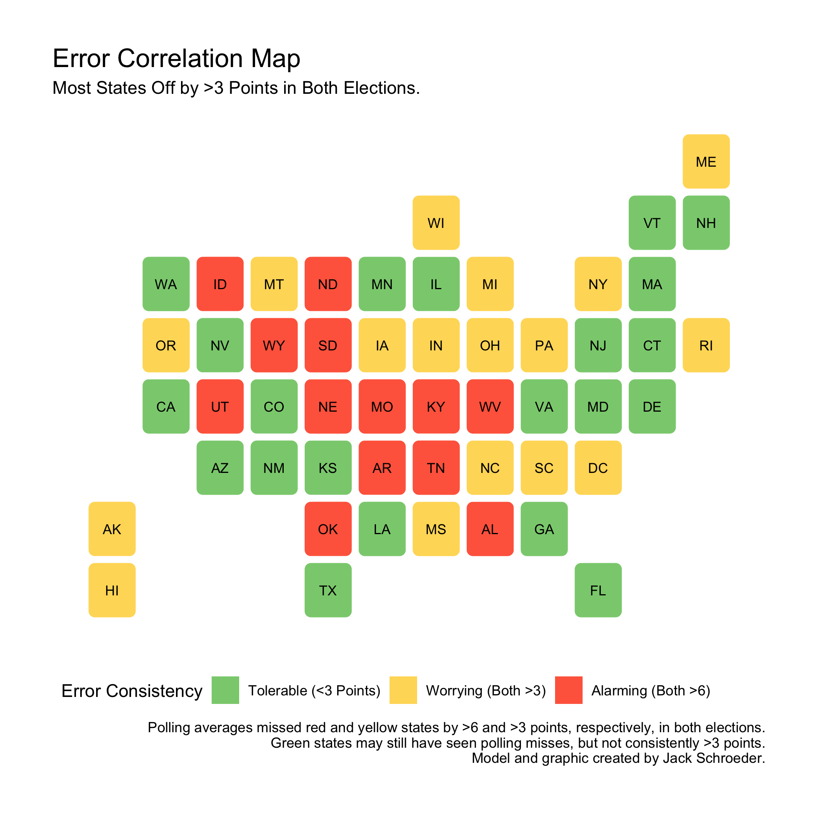
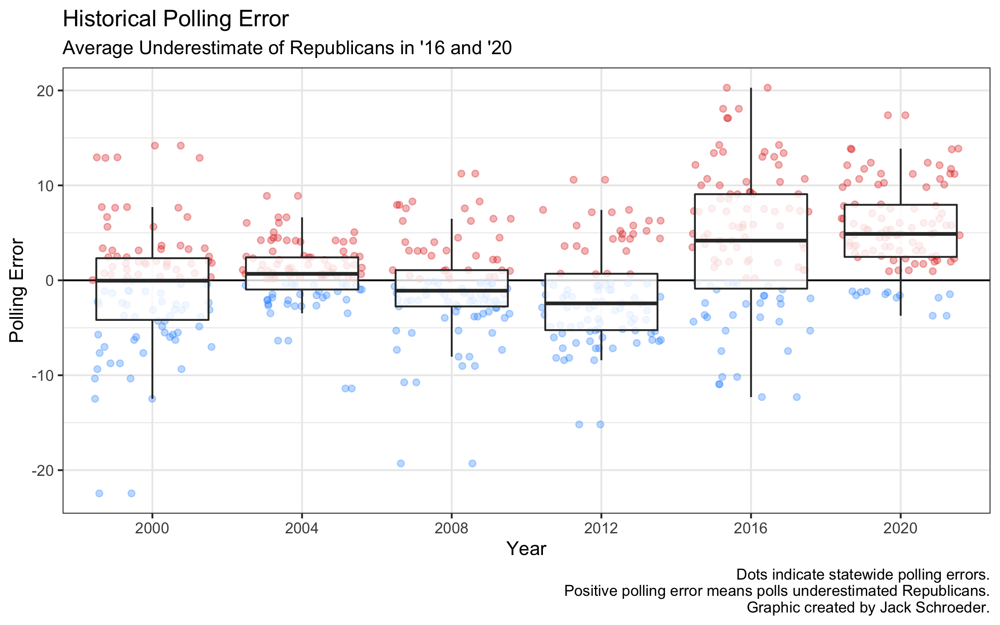
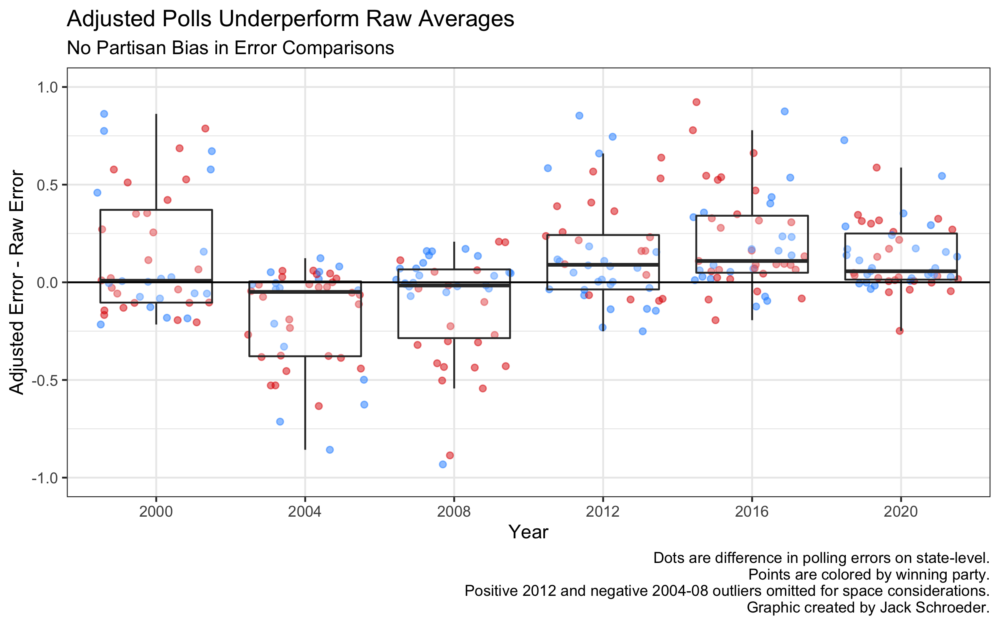

## Post-Election Narrative (12.8.20)

### A Primer

2020 is almost over. The people have voted, the models have been reflected upon, but there’s still time to evaluate some common post-election narratives. This cycle was full of hot takes from both sides preceding and in the immediate aftermath of the election. I plan on tackling one of these narratives: that pollsters and modelers **failed to learn from 2016 and got the same things wrong**.

In the post below, I’ll:

(1) Elaborate on the take,

(2) Craft some testable implications of the narrative,

(3) Gather some data to test that implication,

(4) Explain what the tests *won’t* do,

(5) Test that narrative,

And (6) present conclusions.

### The Take

2016 shocked pollsters. Polls are always wrong, and no serious election analyst will claim otherwise. But polls were wildly off in certain states in 2016. The polling industry boasted about how much it was learning from that election. Even up until Election Day 2020, long headlines like “Pollsters work to increase accuracy after learning from 2016 polling mistakes” (Kasirajan 2020) and interrogative titles such as “Have pollsters in 2020 learned the lessons of 2016?” (Oakes and Fleming 2020) were common. The answer in many of these articles was yes, that pollsters were learning and adjusting to prepare for 2020.

To many, those preparations failed in 2020. For them, the main takeaway from Election Night was that **pollsters failed to learn from 2016 and got the same things wrong**. You didn’t have to look far for this take. It was visible on the front of The New York Post (“Wrong, Wrong, Wrong”), the pages of WFTV Orlando (“The polls were wrong, again”), and the landing page of Politico (“The polling industry blows it again”).

Look back to that WFTV Orlando headline. “Wrong” is not the key word, since, again, polls will always have error. “Again” is the more worrying part of the title, since it implies that **the analytics industry didn’t learn from 2016**.

This is an important narrative to study in an Election Analytics class. Believing in pollsters’ capacity to learn is a *basic indicator of trust* in the industry more broadly. If it appears that the polls were similarly wrong in 2020 as they were in 2016, trust in that industry will decrease. The tangible impact of this could manifest through **lower poll response rates.** People may be less likely to devote time to answering opinionnaires if they believe the industry is fundamentally flawed and unfixable. As a result, preliminary analyses like this will be **vital** for data-focused political junkies going forward.

### Testable Implications

How can the narrative be evaluated *empirically*? There are many ways to construct an analysis here, but I will focus on the following four methods, making sure to add **historical backtesting** when necessary to see if trends hold up with other recent elections:

(1) **Error correlation**: If the take is true, it implies that 2020 error should be correlated with 2016 error. Polls should have gotten states wrong in similar ways between cycles.

(2) **Regression significance**: If the narrative holds, 2016 polling error should help explain 2020 results. I’ll regress 2020 outcomes on polling averages and include past cycle polling error to see if it boosts explanatory power and is significantly correlated with the outcome variable. I’ll also go a step deeper and incorporate my pre-election prediction model.

(3) **Model adjustments**: This focuses more on modelers getting the same things wrong - if that’s the case, we should expect FiveThirtyEight’s adjusted polling averages to be similarly wrong as their 2016 adjusted averages. At a more fundamental level, I’ll also test whether adjusted poll averages outperform raw averages.

(4) **Time sensitivity**: Herding was seen to be a major problem in 2016, and if the take is correct, polls within two weeks of the election may overestimate the perceived leader. I’ll test whether polling averages two weeks out were more reliable in both elections than the averages on Election Day.

### Data

To answer these questions, I’m relying on a relatively spartan array of datasets. The bedrock of this will be statewide popular vote totals this century (all used previously in this class). I’ll augment that data with presidential polling averages (and adjusted averages) from *FiveThirtyEight*. I was tempted to look toward RealClearPolitics for their poll averages, but it makes more sense to compare apples to apples and use only the polls that FiveThirtyEight incorporated into their raw and adjusted averages. The overall combination of data will allow me to calculate polling error on the state level for each state from 2000 onwards.

### Limitations

For transparency, here is what these tests cannot show:

(1) *Causality* and what *actually* went wrong for pollsters in both cycles. Causality would require a much more rigorous approach and more in-depth data. Determining pollster mistakes would necessitate individually analyzing methodologies from each pollster and making a determination of whether weights were rigorous or arbitrary, then extending those findings into results-based analyses. I found it easier and more justified to use the polling averages because they represent the industry as a whole and because I expect the average voter to intuitively focus on the average as opposed to individual firms.

(2) Polling error in *down-ballot races*. There’s been a lot of the polls dramatically overestimating Democrats’ chances in key Senate races. A few notable House races were seemingly missed as well. I lack the data to properly analyze this, since I’m focusing on state-level polls and results on the presidential election.

(3) Which *demographics* polling had the most trouble with. It’s tempting to take these state-level analyses and try to correlate them with state-level demographics, but this would fall under the ecological fallacy. Demographic error is a very important question, though, and many people are likely working on it as you read this.

(4) Whether data journalists have *actually* utilized language surrounding uncertainty in their forecasts since 2016. Text analysis would be useful here, but I don’t have access to an “uncertainty corpus” or a dataset of prominent data-viz articles from 2016 and 2020.

(5) And much, much more. One of the major takeaways from this class has been to avoid large proclamations in favor of nuanced and rigorous positions. I’ll try not to fall victim to this: the work below is a *preliminary* analysis of the election.

### The Tests

#### Error Correlation

If pollsters got the same things wrong in 2020 that they did in 2016, both years’ polling error should be correlated. Before calculating that value, though, it’s worth discussing what exactly polling error means.

There are a variety of ways to measure polling error, but I’ll use the one Silver (2018) focuses on: difference between actual margin and poll margin. This definition assumes the stability of a two-party race, which wasn’t entirely true in 2016, but still useful for my purposes. An alternative, comparing polling point estimates with actual results, suffers because polling includes undecided voters, who eventually have to make a choice at the ballot box. As the graph from my final model shows, while the number of undecided voters in polls decreases before election day, they still exist and could distort this alternative measure. That’s why I’ll stick with Silver (2018)’s definition of polling error.

The correlation I got was 0.65: positive but not that strong. Still, there may be something here, so I attempted to map these correlations out. In the visualization below, states are green if absolute polling error was not consistently above 3 points, yellow if absolute polling error in both elections exceeded 3 points, and red if that error was greater than 6 points in both elections.

This gives more information than the simple correlation estimate, but the insights are very nuanced. The polls are currently under fire from many for badly predicting Florida in 2020, but it is a green state because the polling error was manageable in 2016. For our purposes, though, we’re only concerned with states that polls consistently missed in both elections.

21 states are in this green zone. 17 are in the yellow zone, which means polls were off by more than 3 points in both elections. This is reason to worry, but the focus should be on the 13 red states that saw consistent misses of over 6 points.

The red states - ones where pollsters didn’t seem to learn from 2016 - are heavily red and geographically consolidated away from the coasts. While safe blue states (CA, NJ, etc.) are mostly green, these states are Republican strongholds. Could pollsters be failing to fully gauge Trump support in Trump country? This map isn’t indicative by itself - some deep red states like Kansas and Louisiana are green - but it lends support to the take.

What do these maps look like historically? There were *28 green states* between 2012-16 and *35* between 2008-12. Between 2004 and 2008 (both wildly different elections), there were **45 green states**.

This could be a separate phenomenon from pollsters failing to learn from the previous election. Maybe green states are exogenously decreasing because error wobbles from election to election. The next section will test that theory.

#### Regression Significance

To start out, I plotted historical polling error since 2000. I created a boxplot with all of the individual state-level errors in each election. Those boxes measure average statewide error, which may be different from your definition of average polling error.

Three things jump out: (1) average polling error was pretty small before a huge jump in 2016, (2) error seemed to jump around, even underestimating Democrats on average in 2008 and 2012, and (3) 2020’s error was similar to 2016’s.

That third point is the most important to the narrative. If pollsters got the same things wrong in 2020, we should expect not just similar errors but that the previous errors can help explain future results.

As the table below indicates, including past error in a simple model didn’t help boost explanatory power before 2016. But using 2016’s error to help predict 2020 was immensely useful, boosting the adjusted r-squared of the model by almost 4 points.

Why is there a significant boost? Go back to the graph: 2016 and 2020’s errors are very close. The regression comparisons tell us that the similarity in average state error seems to be helping on the individual state level as well.

What does this mean? Preliminarily, this supports the polling skeptics. For all the boasting of fixing polls by weighing education documented by Skelley and Rakich (2020), the errors from both elections do seem to be fairly similar.

This isn’t fair to Skelley and Rakich, though, who work at *FiveThirtyEight*. Their jobs are to be skeptical of polling and try to account for error through their models. Just how well those models account for polling error is the focus of the next section.

#### Model Adjustments

The reason election models are necessary is because polls will inevitably be off. As mentioned above, modelers include other variables to counteract polling error. Some modelers, though, try and adjust the polls before adding these other variables. *FiveThirtyEight* does this through their raw and adjusted polling averages.

I wanted to see if these adjusted averages outperformed their raw counterparts. To do this, I subtracted raw polling error from adjusted polling error for each election this century. A negative difference means the adjusted error outperformed raw error (which is good for *FiveThirtyEight*), and vice versa with positive differences.

The adjusted averages do well until 2012, where they stop beating the raw errors. Why? Since *FiveThirtyEight* wasn’t around before 2008, the poll adjustments before that election were most likely done after-the-fact, and the adjustments themselves were probably trained on those results. They should be performing well.

For the last three elections, though, it’s possible that the adjustments were created before results were known and not fitted afterward. Another possibility is that the adjusted averages are adjusted even more through the modeling process.

What does this mean for the take? The purpose of comparing these averages was to see if modelers seemed to learn to account for polling error. On a whole, *FiveThirtyEight*’s model did better this cycle - correctly predicting the winner helps in that regard - but this test is inconclusive. If 2020 and 2016 were outliers in the adjusted error failing to beat the raw error, there could be reason to probe this further. But since 2012 also saw the raw averages beat out the adjusted ones, there’s no support for modelers failing to have learned from 2016.

There’s one final thing to check in the polls, though, and that’s whether they made the same mistakes within two weeks in both cycles.

#### Time Sensitivity

If pollsters failed to learn from 2016, then herding should have impacted both elections in similar ways. Herding is the process of internally adjusting results to match the common consensus. The industry at-large was accused of herding results leading up to Trump’s victory in 2016. If this is right, and pollsters failed to account for this, polling averages should have moved in similar directions in both elections.

To measure this, I decided to update a graph used in my reflection to include 2016 results. The graph shows average support between 2-10 weeks before the election, then average support up to two weeks, average support on Election Day, then the actual result. I segmented the graph into four quadrants, each representing who ended up winning the state. The polls didn’t get every state right, so point color shows which candidate was perceived to be leading at each moment.

As the graph shows, Trump saw slight increases in poll averages leading up to the election, particularly in states the polls got wrong. This may have been a sign of undecided voters moving toward Trump in the closing moments of the campaign.

The polls didn’t move in the same way in 2020. In fact, they didn’t seem to move much at all.

Many pundits noted how - coronavirus aside - the election was relatively boring due to polling stability. While the polls underestimated Trump in both elections, 2020’s stability means they likely didn’t do so in the same ways.

What does this mean for the take? It casts doubt on the premise that herding moved (or failed to move) the polls toward Trump in 2016. Polling averages seemed to be moving in his direction up until Election Day. It could be the case that herding prevented even larger moves, or that other measurements would show herding in 2016. Either way, there isn’t support for the idea that the polls moved in similar ways in each election, making it tougher to justify the take that pollsters didn’t learn from 2016.

### Conclusions

Especially when the outcome was still in doubt, many people believed that pollsters failed to learn from 2016. I set out to judge this empirically.

These simple and preliminary tests yielded conflicting results. On the one hand, polling error seems to have been fairly consistent between 2016 and 2020. Many states were predicted incorrectly by similar magnitudes in both elections, and 2016 polling error uniquely boosted the predictive power of a simple results ~ polling regression for 2020.

However, *FiveThirtyEight*’s poll adjustments also failed to beat raw averages in 2012, and the trends described above may well be an exogenous shift in electoral preferences that’s completely separate from the industry’s learning capacity. The discussion on herding also reveals unique complexities between 2016 and 2020, as well as a potentially misinformed consensus on herding from 2016.

Overall, I’m relatively confident the data show that polling error was similar between 2016 and 2020. That said, *polling* error is different from *pollster* error, and I don’t have the evidence to make a judgement of the industry as a whole. Due to the limits of these analyses, I probably wasn’t going to end up in a position to be able to have a sweeping conclusion. Still, these tests were useful in relaying to me the complexity in evaluating common narratives and the many directions that can take.

### References

Silver, N. (2018, May 30). “The polls are all right." *FiveThirtyEight*. Accessed online.

Skelley, G., and Rakich, N. (2020, Oct. 13). “What pollsters have changed since 2016 - and what still worries them about 2020.” *FiveThirtyEight*. Accessed online.