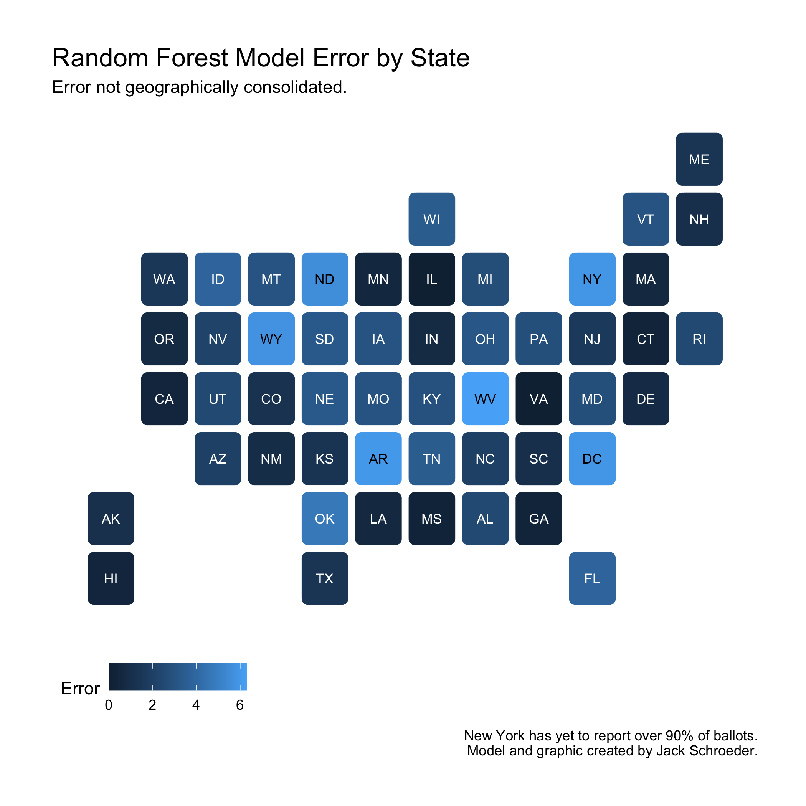
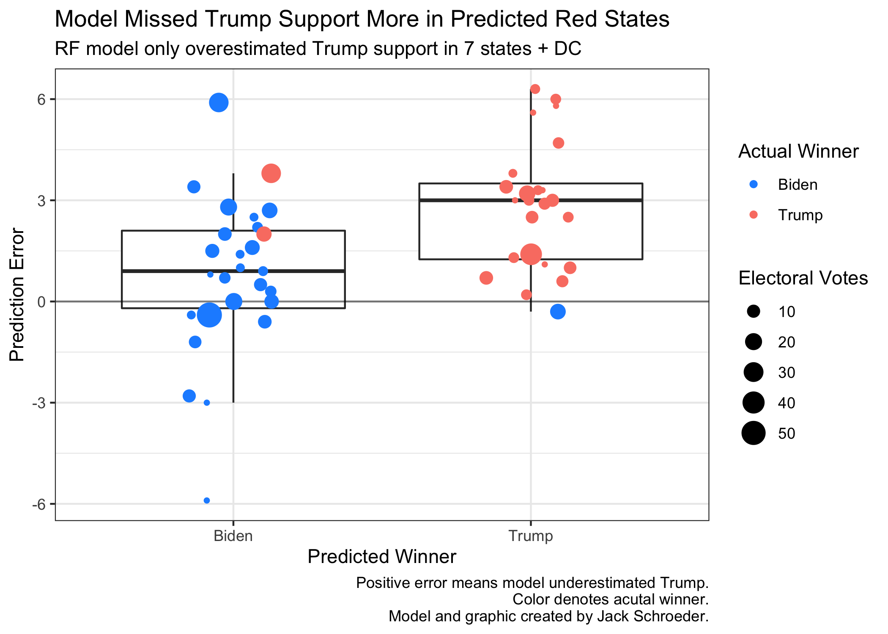
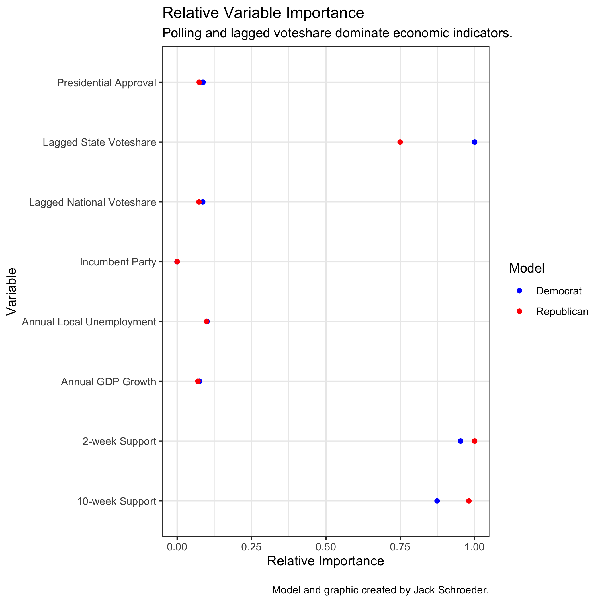

## Post-Election Reflection (11.22.20)

### A Primer

Now that the 2020 election is (mostly) behind us, it’s time to evaluate my model and its components. In this post, I’ll be answering the following questions:

(1) What exactly was my model, again, and how did it do? (The random forest regression performed better than expected, but still room for improvement!)

(2) Is there anything to learn from my alternate specifications? (Previous error is worth considering, but take it with a grain of salt.)

(3) How was my error distributed? (It was more based on party than geography.)

(4) Where did my predictors go wrong, and can I quantitatively test these beliefs? (I have some theories that may be testable.)

With that in mind, let’s proceed to a quick model recap:

### Model Recap

My final model was a random forest regression predicting each party’s two-party voteshare in each state.

**What is a random forest?** It is a regression/classification technique based on decision trees (think: flowcharts). A single decision tree is prone to overfitting the sample data and inaccurately predicting future outcomes. Random forests try to avoid these issues by forming many trees, each with a random sample of the data and only a handful of the predictors. The model averages each tree’s prediction and spits out a final point estimate. Each party had its own model, which predicted a two-party voteshare estimate for each state. I took the predicted voteshare for each party in each state to get a final two-party voteshare estimates.

**What did I feed into the model?** Throughout class, we worked with many different sources of data. I ended up with eight predictors: polls (two-week and ten-week state polling averages), fundamentals (annual national GDP growth, annual local state unemployment, presidential approval, and a dummy variable for incumbent party), and lagged variables (2016 national and state voteshares). Since each tree had a random sample of data, each variable had to have complete data. This kept me from using data pre-1980.

**Is the model any good?** Historically, the party models average out to a root mean square error of **3.02 percentage points**. What does this capture? This is the in-sample error of the model’s predictions. However, due to the random sampling of data within each tree, this number also helps account for out-of-sample error, since each tree only had access to a subset of the overall data.

**What was the prediction?** As the visual below shows, I predicted a healthy Biden victory of 334 electoral votes to Trump’s 204. There were seven states within the historical error (in order of predicted Trump support): Arizona, Florida, North Carolina, Georgia, Ohio, Iowa, and Texas.

**How did it do?** Not bad at all. It got three states wrong: Florida, North Carolina, and Georgia. The model missed Florida by more than the historical error (it was 3.9 points off). North Carolina was a bit closer at 2 points off. Surprisingly, Georgia was tied for the fourth-closest state, with the predicted estimate only being off by 0.3 points. Overall, the model had an **RMSE of 2.966**. That number drops to 2.856 when New York is excluded due to incomplete results that currently favor Trump. Either way, the RMSE outperforms the original RMSE of 3.02, which is pretty unexpected for an election said to be hard to predict.

**How does this error look?** I’m glad you asked, since it’s plotted below! One fun outcome: Virginia, with a predicted Trump two-party voteshare of 44.8%, was *accurate down to the tenths place*! Overall, the model missed low on Trump support, particularly where he was projected to be strongest.

Before dissecting this error, though, I want to go over one of the alternate scenarios from my final prediction:

### Scenario Planning

Before the election, I outlined some other specifications of the model. Some of these changed components in the model, but most relied on changing the prediction inputs for 2020. In one of these, I adjusted polling averages in swing states by the 2016 polling error. I ended up with the following prediction:

Why bring this up? This prediction did *better* than my prediction above. It only got two states wrong (Florida and Georgia) and had an RMSE of 2.911 (down to 2.788 without New York).

Intuitively, this makes sense. There were many polling skeptics this year who believed that underlying problems hadn’t been addressed. I’ll deal more with polling later, but this result is interesting but not necessarily important. As Silver (2020) notes, polling error tends to swing unpredictably between elections. Much like how generals tend to fight the previous war, it probably isn’t the best move to predict the same election by adjusting for previous error. That said, if you have reason to believe this error is endemic to polling and will persist, prior error will be vital to modeling going forward. More on this later.

### Prediction Hypotheses

Needless to say, there is a lot to unpack from this election. What I want to do from here is offer some hypotheses as to where and why my model was wrong and propose or conduct tests to evaluate those beliefs.

Two simple hypotheses arose from looking at prediction error:

*H_1: Model error was geographically distributed, with higher error in the Southeast.*

*H_2: Model error was ideologically distributed, with higher error for redder states.*

Both of these hypotheses can be initially tested through visuals.

To begin evaluating H_1, I plotted RMSE by state:

There does not appear to be any geographic basis for saying any region had sizably more error than another. This is largely due to the fact that the states the model predicted inaccurately did not have the largest percentage errors. Instead, states like West Virginia, Oklahoma, and New York (due to incomplete data) had the largest error, and states like North Carolina were relatively accurate. As mentioned above, the Georgia point estimate was within half a percentage point of the actual result.

Still, I can’t entirely discount H_1. To evaluate it further, I would look to regress error on geographic area (probably the Census designations) along with other variables to account for other factors. I wouldn’t anticipate needing any more data than what I currently have to conduct this analysis.

To start testing H_2, I plotted error on predicted winner:

Based on the graphic, H_2 appears to have merit. The average predicted Republican state had a higher error than the average predicted Democratic state, even though there were more predicted Democrat misses (Florida and North Carolina) than predicted Republican misses (Georgia).

However, this doesn’t fully answer the question, since the visualization doesn’t convey how red and blue these states were. I’d want to dive deeper by analyzing state “stickiness” - how often it votes for the same party - and see whether that is correlated with prediction error. If that’s the case, I could also run regressions here to account for other factors. My guess is consistent with H_2: sticky red (and, to a lesser extent, sticky blue) states likely have higher prediction error.

This may be a symptom of increased polarization on the state-level, as red states go redder and blue states go bluer. This fits with Rodden (2019), who shows how Democratic voters are inefficiently distributed across states, so there are more red states than blue. Due to this imbalance in political geography, this would likely result in the average state (and potentially the tipping-point in Electoral College votes) trending redder than the nation.

### Predictor Hypotheses

Until now, I’ve been focusing on the model *predictions* and leaving aside the individual *predictors*. That changes here.

To ground this discussion, here is a plot of each predictor’s relative importance within the random forest model. Remember that each decision tree within the random forest has access to a subset of predictors. What this plot measures is which predictors trees leaned on more often when given access to them. These are relative values, though - variables with the highest importance were not available to every tree - and were calculated for each party model.

Three implications here:

(1) The three most important predictors are the polling averages and lagged state voteshare. There is variation in relative importance for these predictors between models. This isn’t necessarily bad, though, since it justifies my choice to choose party-based models.

(2) The only variable with a significant difference in relative importance is lagged state voteshare. This could be a testament to the relative stickiness of blue states, which deserves further exploration.

(3) The “fundamental” predictors were all substantially less important to the model than the polling averages and lagged state voteshare. It was widely assumed that the pandemic would make 2020 a bad year for fundamentals-based forecasts, but it appears that the random forest model treated these variables as subordinates when possible.

That doesn’t mean the fundamental variables are unimportant. In fact, the economic indicators in particular inspire two more hypotheses:

*H_3: Economic variables underestimated Trump support because across the board, voters didn’t “blame” him for the economic crisis.* This assumes that voters held largely similar views on the economy that, if measured, could have reduced the underestimate.

*H_4: Economic variables underestimated Trump support because in red states, voters didn’t “blame” him for the economic crisis.” This assumes that Trump’s supporters were likelier to give him a pass on the economy. The distinction here is crucial because of the model’s aforementioned undercounting of Trump support in deep red states. 

To evaluate these claims, I would need access to economic approval ratings. I’m aware of certain questions asked to voters on whether they blamed Trump for the pandemic, but I don’t know if questions of blame are historically available. If they are, I’d run my models again with economic approval ratings included to gauge whether this would have any effect.

Now, let’s look at the most important components of the model: polls and lagged state voteshare.

How did correlates do?

Polling more specifically - steady then shift

### Takeaways/Room for Improvement

ME and NE
Less of a black box
More historical backtesting - explicitly conduct leave one out to better account for out of sample
More predictors - especially ones that vary by state