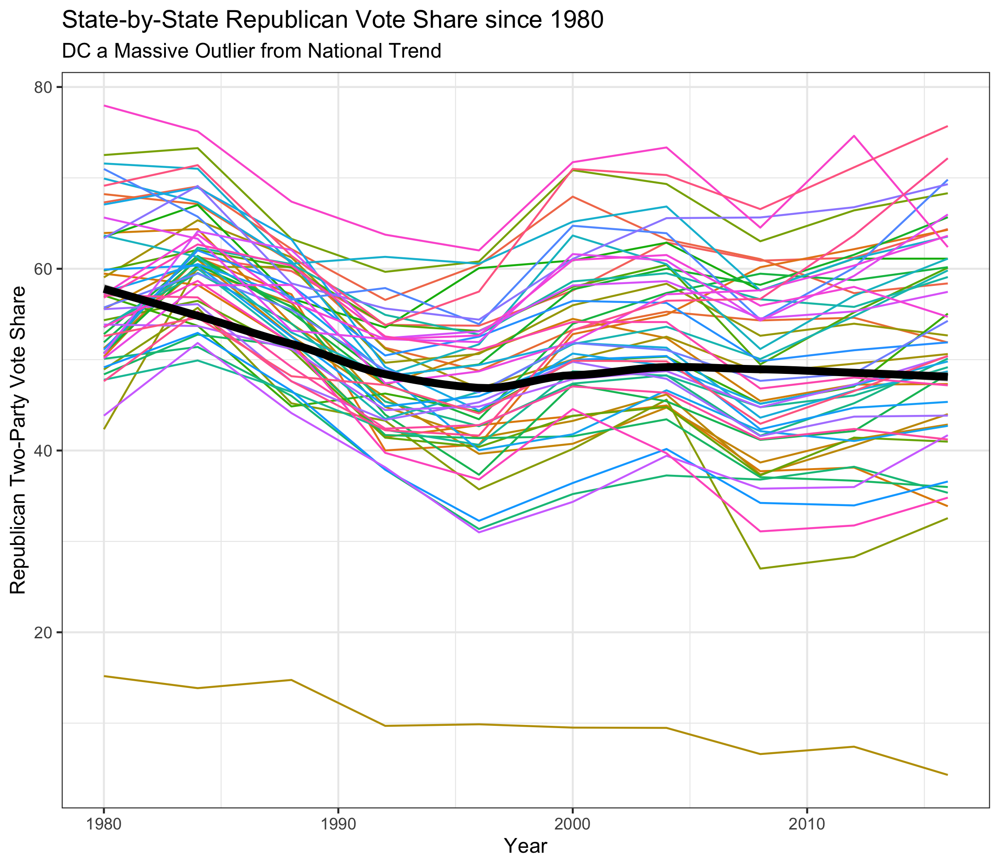
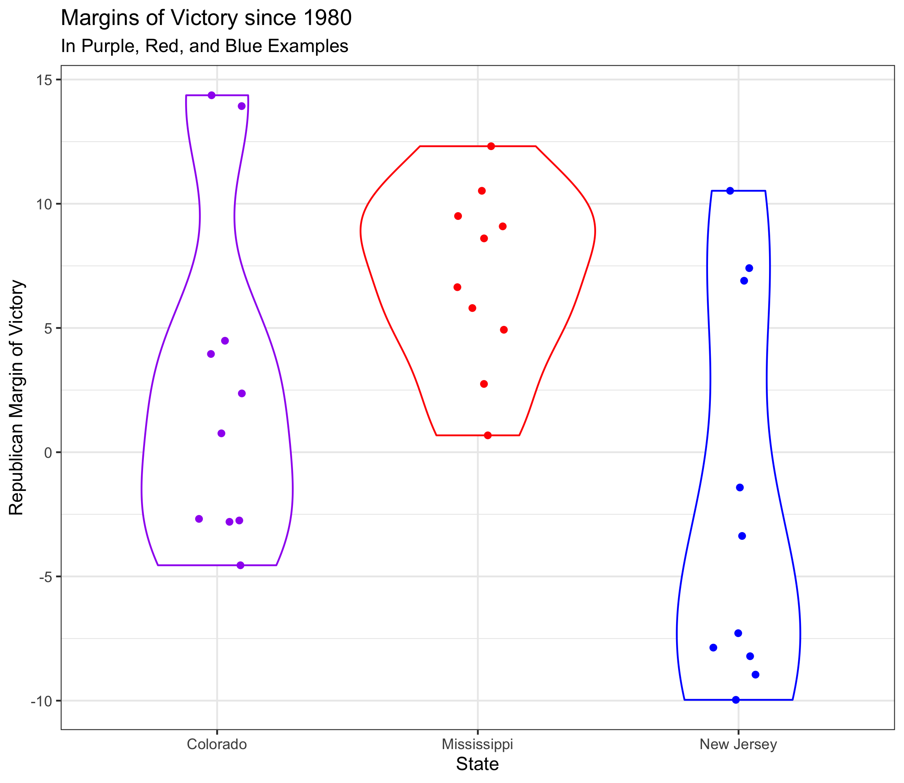

## Introduction (9.12.20)

### A Primer

This week, I worked with two bare-bones datasets. One relayed national popular vote totals in presidential elections, and the other contained state-by-state totals of the same information. For the below content, I focused on outcomes in the last 40 years, starting with the 1980 election.

These datasets lack predictive power because electoral outcomes are not wholly dependent on prior outcomes. Instead, I will create a predictive model in later weeks using a diverse set of benchmarks and indicators.

As a result, this week is focused on *data exploration*. Namely, I set out to analyze any simple trends hidden within these CSV files and plot them with the `ggplot` library.

### National Vote Share Trends

I first observed general variations in the national vote share between the two major parties (Republican and Democrat). Uniquely, most Americans internalize the results of elections through Electoral College votes, since they decide the winner. The general public largely disregards the popular vote, which can mask discrepencies between the two outcomes.

The current data only focus on the popular vote, so I am undergoing a descriptive analysis to answer two questions.

(1) Do vote shares vary much from election to election?

(2) Which state is the largest outlier in two-party vote share versus the national trend?

To answer these questions, I cleaned both datasets and added variables for vote margin and vote swing. I then graphed Republican two-party vote share versus year for each state. I also added a national trendline to accentuate the average.

This visualization yields three distinct conclusions:

First, although certain states have deviated from a split two-party vote share in certain electoral cycles, **"landslide" electoral victories like Reagan in 1984** (where he lost one state and Washington, DC) **do not carry nearly the same magnitude in terms of the popular vote.** So, to answer question 1, vote shares do not vary nearly as much as previously thought.

Second, **elections are getting closer.** Results in this millennium tend to be closer to 50% than those previous. There are a variety of reasons behind this, but an important one may be polarization of the electorate. While many voters may have swung Republican in 1984, there may simply be fewer swing voters.

Finally, **DC is the only major outlier**. The large majority of the 50 states are consistently within 15 points of the national two-party vote share, but the District of Columbia is the only state where Republicans have won less than 25% of the two-party vote share within the timeframe. Without hesitation, the District has voted overwhelmingly Democrat in every cycle since 1980, and their Democrat leaning seems to only be increasing.

There are two extensions for this visualization that will be improved upon in the next few weeks: (1) x-axis breaks corresponding to election years and (2) a horizontal line at 50%, signifying an even split in the two-party vote share. These should improve the graph's readability and allow the reader to more easily garner its conclusions. Another extension for the next few weeks is to plot national popular vote share versus electoral vote share, which could lead to some interesting visualizations.

### Blue, Red, and Purple: Intrastate Trends

Additionally, I analyzed within-state trends since 1980. Generally speaking, states fall into one of three categories in electoral politics: red (consistently Republican), blue (consistently Democrat), or purple (a swing state). I picked an example of each of these states to work with. For a red state, I chose Mississippi, which has voted Republican in every election within the timeframe. For blue, my home state of New Jersey is commonly seen as a Democratic stronghold. Lastly, I selected Colorado as the purple state due to its tendency to swing between the two parties.

I sought to answer these questions with a visualization:

(1) How large are the differences in Republican margin of victory/defeat between these three states?

(2) How can I effectively show these differences in a simple, straightforward manner?

I created a violin plot of the Republican margin of victories in the three states post-1980.

There are three takeaways from the graph:

(1) Using a violin plot helps visualize the high density of wins for Republicans and Democrats in their respective states. Colorado's wider shape around smaller margins of victories and defeats helps the reader infer that it is a swing state, even if the color was not there as a guide.

(2) At this level of focus, the separate voting patterns of red and blue states are distinguishable to the naked eye. By using less ink, it is clearer to see what makes Mississippi and New Jersey different in a way that the first plot could not offer.

(3) While Colorado is a swing state today (and borderline Democrat), it used to vote Republican fairly reliably. Similarly, although New Jersey is indeed blue, it does have three Republican victories since 1980.

A potential extension of this graph would be to create a Shiny app that allowed the reader to pick their own red, blue, and purple states. I also debated adding repelled labels using the `ggrepel` library, but decided against it due to decreased readability. That said, labeling the outliers could help readers easily ascertain when exactly New Jersey voted Republican.