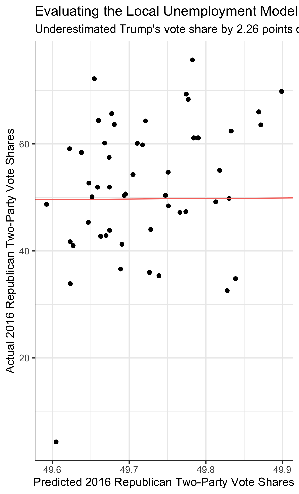

## The Economy (9.19.20)

### A Primer

This week's focus was *the economy*. One of these datasets described national economic indicators (GDP growth, stock market trends, inflation, unemployment). The second contained local economic indicators by state and area (unemployment and labor force participation).

I decided to create simple models with these datasets and evaluate their performance. Instead of predicting a 2020 winner, I decided to test the models with 2016 results to see if they were overfitting. This was because, similar to last week, I only counted results from 1980 onward.

I sought out to answer these questions:

(1) How well do these models explain popular vote outcomes? (Decently well, at least for the national model.)

(2) Did this vary between a national-leaning model and a local-based one? (Yes.)

(3) What would these models have predicted in 2016? (Both understimated Trump.)

### Data Cleaning

I took both datasets and calculated averages of each indicator over the course of a presidential term. For example, the first quarter of 2013 to the last quarter of 2016 comprises one term. A potential issue with this is that trends from the last quarter of an election year (1) contain almost two months of post-election data and (2) are also not published until after the election. That said, including the last quarter of the year within the term makes sense because it incorporates any economic shocks immediately preceding the election (in October and the first week of November), which may have an outsize impact on how people vote. As a result, I stand by my definition of a term for this exercise.

I merged these annual and term-based indicators with national and state-level popular vote data, creating two master datasets (`national` and `local`) to make models with.

### Constructing the Models

I was primarily interested in evaluating unemployment, since it was an indicator present nationally and state-by-state. I wanted to play these measures off one another, creating one model with local data and one model with national data.

The other inputs into the model were GDP growth and party incumbency. Since neither of these varied between the two models, I only included them to account for larger, national shocks and which party was in power.

The output variable for all of the models is Republican two-party popular vote share. This is the national total for the national models, and the local models correspond to the state-by-state levels. Since both of these variables have the same range (0 to 100), it should be fairly easy to interpret between the specifications.

### Evaluating the Models

These two models are (1) and (3) in the table below. Models (2) and (4) are the results of those models without data from 2016.

There are a few takeaways from the table:

First, **national unemployment is more significant** than local unemployment in these specifications. That said, national unemployment was no longer significant at the 0.1 level once taking 2016 data out in model (2).

Second, **GDP growth matters**, even after taking economic indicators into account.

Third, **the national models explain much more of the variation than the local models**. I focused on adjusted r-squared. This is because unlike normal r-squared, which always increases when the model has more parameters, adjusted r-squared "punishes" the model's score if the additional paramters are not explanatory. This is probably the reason why the r-squared dips so low between the national and local models, even though both models are rather similar. Still, the national model's adjusted r-squared of ~40% is a fairly good indicator for the simple model's strength.

Finally, **there is a large potential for overfitting in these models**. An extension to this post would be to calculate these models with data going further back in time to see if the values change.

### 2016 Predictions vs Reality

As explained above, models (2) and (4) evaluated models (1) and (3) without data from 2016. This is the "leave-one-out" technique explained in section.

The local model yielded 51 distinct predictions for 2016 results (for the 50 states plus DC). In the visualization below, I graphed the predicted Republican vote shares versus the actual Republican vote shares. I also included a red reference line with a slope of 1. Values closer to this line are more accurate.

There are three takeaways from the graph:

(1) **The model expected a very tight distribution of Republican two-party vote shares**. This is because the only aspect of the model that varied between states was unemployment, which I would expect to be fairly uniform across the country.

(2) **The errors do not appear to be correlated**. This is a good sign for the local model's health.

Overall, the local model *underestimated Trump's 2016 vote share by 2.26 percentage points*. This is only slightly more than the *national model's underestimate of 2.21*. I'm decently satisfied with this result, but the goal would be to reduce this error in future weeks by adding more/better parameters to the model.

A potential extension of these models would be to *include lagged vote share*, which would hopefully reduce the error and produce a wider distribution of predicted values within the local model.