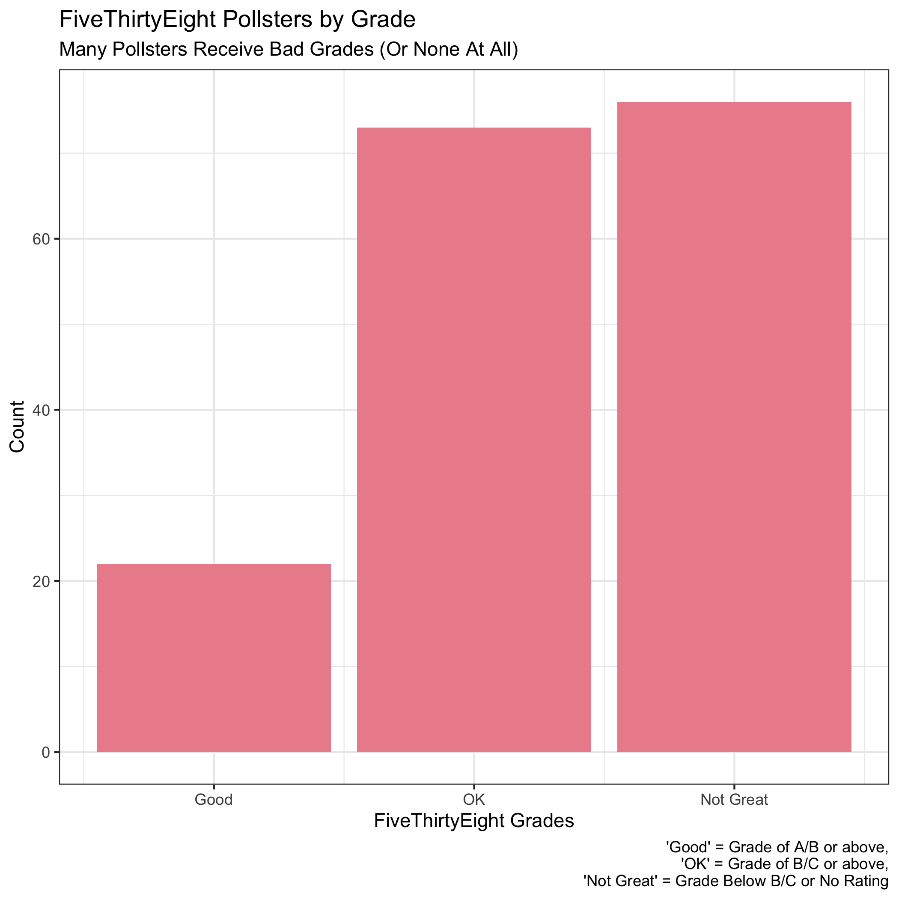
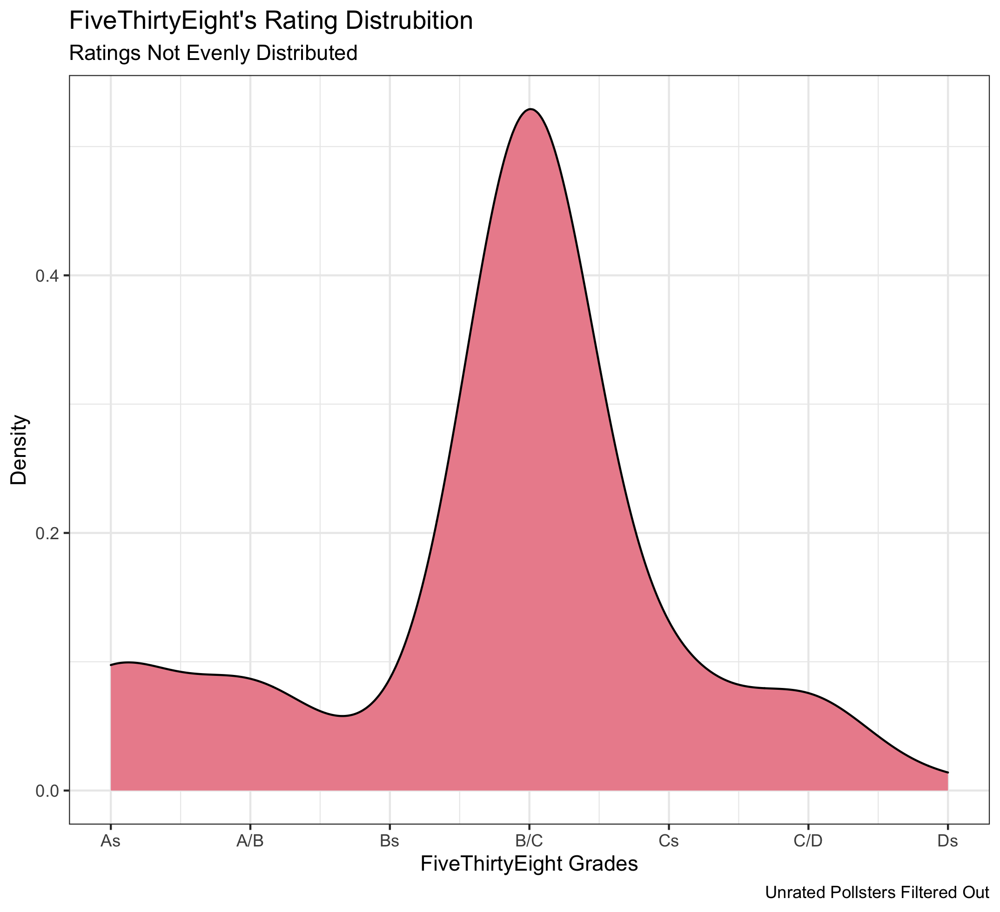
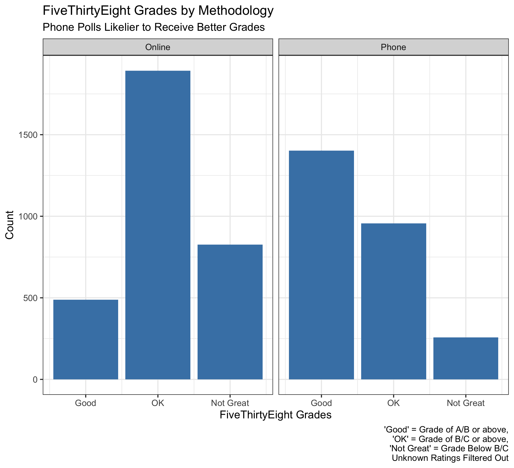
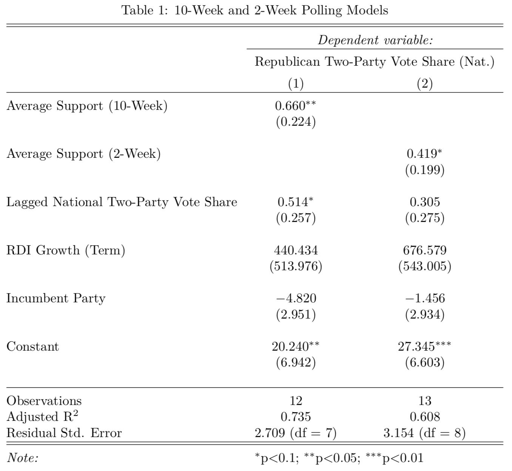
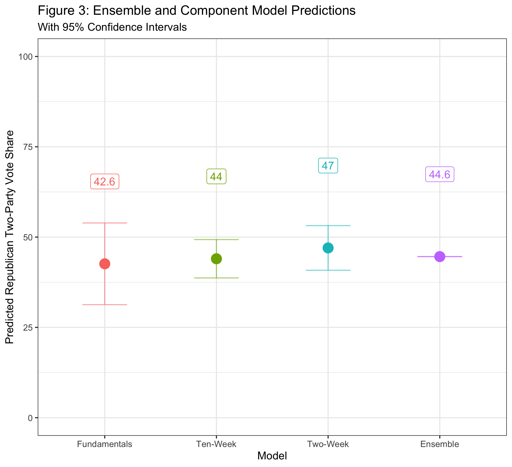

## The Economy (9.19.20)

### A Primer

This week's focus was *polling*. Amanda Cox of [The Upshot](https://www.nytimes.com/section/upshot) visited lecture and gave insightful comments on the state of polling in the age of Covid. In lab, we learned more about polls as they relate to predicting electoral outcomes.

We were given a few datasets to help with this week's lab. Two included polling averages in presidential elections dating back to 1968 (national and by state). We also received raw polling data for the 2016 election and for the current race. This dataset included **FiveThirtyEight**'s pollster ratings, which evaluate firms based on both historical accuracy and statistical rigor.

Finally, a new concept in lab was ensemble models. Essentially, these models take predictions from a multitude of other models and weigh them accordingly.

With all of this in mind, I wanted to answer four questions with this week's blog post:

(1) Are the pollster ratings evenly distributed? (It's more of a normal distribution, albeit with a lot of firms not yet rated.)

(2) Do these ratings vary by methodology? (Phone polls are generally viewed as higher quality.)

(3) Can I update my models to include polling averages? (Yes, and this helps greatly in predictions.)

(4) Lastly, what would my own ensemble model predict for this year's election? (Biden winning in a landslide.)

### Pollster Ratings

Each poll within the dataset of 2020 polls has its own rating from FiveThirtyEight. After filtering for general election polls and creating buckets of pollster ratings ("Good", "OK", and "Not Great"), I created a simple visualization of pollsters and their ratings.

There are three takeaways from this histogram:

(1) Only a select number of pollsters (far less than one-third) qualify for a "Good" rating (above a B+).

(2) There are many "Not Great" pollsters. This is mainly due to pollsters without ratings. Going forward, I will filter them out before making visualizations. For this historgram, however, including them helps make clear that there are a relatively small number of trusted pollsters.

(3) With these in mind, it becomes clear that FiveThirtyEight's intentions with pollster ratings is for more of a *normal-looking distribution* instead of ratings evenly distributed across grades. This makes sense from a lot of angles, specifically in rewarding rigorous pollsters.

To test this, I created the plot below.

FiveThirtyEight's most common rating (by far) is a B/C.

### Methodology

As discussed in lab, phone polling is generally viewed as better than online polling. Part of this is because some online polls are subject to manipulation, and, broadly speaking, phone polling should reach a more representative population than online polls. I wanted to see if this assumption holds true in FiveThirtyEight's pollster ratings.

There are three possible outcomes. The assumption may hold true, meaning the website gives higher polling ratings to predominantly over-the-phone polls. On the other hand, since there is a perceived bias toward trusting phone polls, it is also possible that online pollsters work harder to ensure a representative sample, which FiveThirtyEight rewards with higher grades. All that said, it's also possible there is a similar distribution between the two mediums, which would also make sense.

The visualization below segments each individual poll by methodology. I took raw polls (instead of grouping by pollster) to get a sense for the general polling environment, since some pollsters may produce significantly more polls than others. For polls that contained both online and over-the-phone elements, the dataset seemed to indicate which medium was used more by listing an online/over-the-phone method first. 

A few takeaways from the graph:

(1) There is more online polling than over-the-phone. This is probably due to cost, but it is interesting that it still holds true when filtering out unrated pollsters (since new, spontaneous pollsters are likely unrated).

(2) Phone polls tend to be higher-rated than online polls. This lends credence to the assumption that phone polling is more rigorous.

(3) There are a significant amount of well-rated phone polls. This may be because phone pollsters with the capability to produce large number of polls also have the resources to be very rigorous and the track record to be predictive.

A nice extension of this work would be to see if *national and state pollsters differ* in rating or methodology. This may be worth looking into next week.

### Model Building

### Ensemble Model

