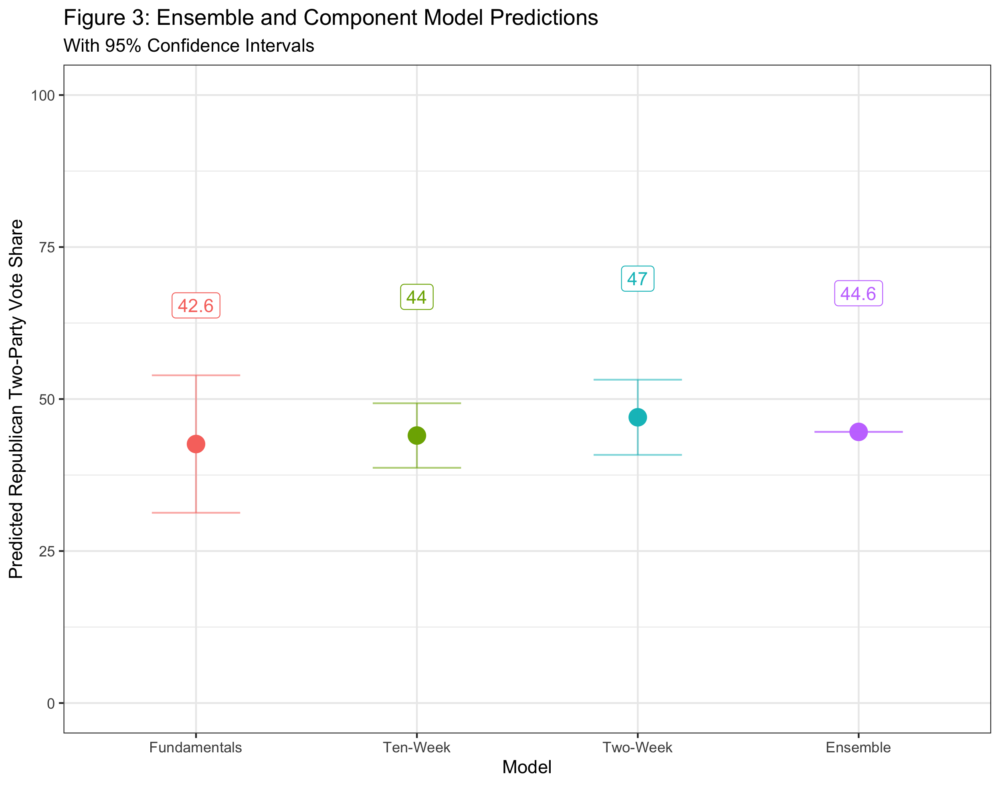

## The Economy (9.19.20)

### A Primer

This week's focus was *polling*. Amanda Cox of [The Upshot](https://www.nytimes.com/section/upshot) visited lecture and gave insightful comments on the state of polling in the age of Covid. In lab, we learned more about polls as they relate to predicting electoral outcomes.

We were given a few datasets to help with this week's lab. Two included polling averages in presidential elections dating back to 1968 (national and by state). We also received raw polling data for the 2016 election and for the current race. This dataset included **FiveThirtyEight**'s pollster ratings, which evaluate firms based on both historical accuracy and statistical rigor.

Finally, a new concept in lab was ensemble models. Essentially, these models take predictions from a multitude of other models and weigh them accordingly.

With all of this in mind, I wanted to answer four questions with this week's blog post:

(1) Are the pollster ratings evenly distributed? (It's more of a normal distribution, albeit with a lot of firms not yet rated.)

(2) Do these ratings vary by methodology? (Phone polls are generally viewed as higher quality.)

(3) Can I update my models to include polling averages? (Yes, and this helps greatly in predictions.)

(4) Lastly, what would my own ensemble model predict for this year's election? (Biden winning in a landslide.)

### Pollster Ratings

### Model Building

### Ensemble Model

