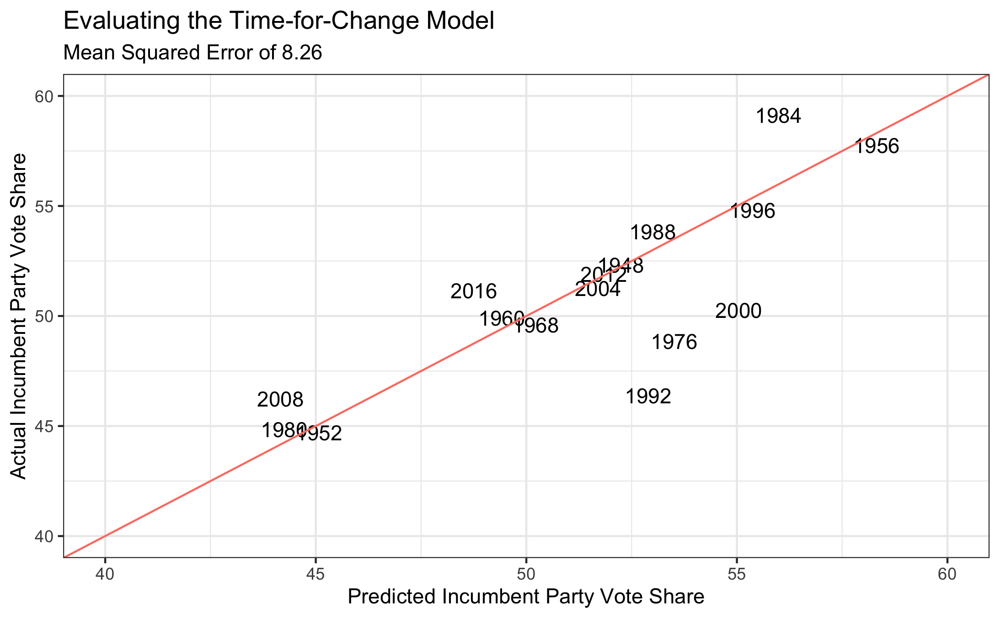

## Incumbency and Time-for-Change (10.3.20)

### A Primer

This week, I work with the famous *"time-for-change model"* and apply its predictions to 2020. I also update my *ensemble model* under the hood and compare its results to the time-for-change. I sought to answer the following questions:

(1) Do voters get tired of incumbent parties? (Yes.)

(2) Does a model based on (1) beat my ensemble model in predicting 2020? (No.)

(3) Is 2020 a good year to rely on the "time-for-change" model? (No.)

### Time-for-Change

Alan Abramowitz, a political scientist at Emory, developed a "time-for-change" model back in 1988 to predict election outcomes. In its simplest form, it uses the following formula to predict incumbent party vote share (taken from Abramotiwz [2016]):

$ 47.260 + 0.108 * Net Approval + 0.543 * Q2 GDP + 4.313 * Incumbent Dummy $

In Abramowitz (2016), the model has an adjusted r-squared of 0.9, signifying a very strong and predictive model.

With this in mind, I adapted section code to create inputs for a time-for-change model using the data used so far in class.

Graphing the predicted values and the actual outcomes, the model seems to do a fair job of picking winners. However, the model has a *mean squared error of 8.26* and an **adjusted r-squared of only 0.6**.

There are also new coefficients, resulting in a different formula from above:

$ 47.176 + 0.103 * Net Approval + 1.764 * Q2 GDP + 2.876 * Incumbent Dummy $

Why the difference? Abramowitz (2016)'s model hasn't yet refitted the model with 2016 data, since it tried to predict the Trump-Clinton contest. It was bullish on Trump's chances, but not in the correct way. Clinton won the popular vote, but Abramowitz (2016) predicts a Trump popular vote victory. The author is hesitant about predicting Trump in the popular vote, but either way, 2016 seems to diminish the efficacy of the model. Before answering whether it can be useful for 2020, though, I need to update my ensemble model.

### Updating the Ensemble Model

This week involved some under-the-hood changes for the ensemble model. I streamlined my data collection by outsourcing my code from the weekly files into a centralized R script that lets me more easily use the same data each week. Also, instead of choosing a party to base models off of (my models usually predicted Republican two-party vote share), I'm switching to incumbent/challenger, since this will allow me to compare outcomes with the time-for-change model.

The ensemble model inputs haven't changed much since last week. I'm still using three models:

(1) A fundamentals model that uses term-wide national unemployment, annual GDP growth projection, and incumbency (instead of incumbent party).

(2) A ten-week polling model using lagged national vote margin, term-wide real disposable income growth, incumbency (instead of incumbent party), and a polling average ten weeks from Election Day.

(3) A two-week polling model with the same inputs as (2), substituting two-week polling average for the ten-week results.

Graphing the model, we see values much closer to the trendline, indicating a better-fitting model. However, I don't want to rely on visuals alone to compare this ensemble model with the time-for-change model above. For that, I use mean squared error.

The ensemble model has a **mean squared error of only 1.60**, which is vastly better than the adjusted time-for-change model! This is a good sign going into 2020 predictions.

### 2020 Predictions

2020 is shaping up to be a strange year for fundamentals-based forecasting because of the large economic discrepencies in indicators like quarterly GDP growth. A model focusing on second-quarter GDP growth in particular seems susceptible to vast underestiamtions of the incumbent party vote share this year because of a uniquely extreme value (-33.3%). That alone leads me to believe the time-for-change model may struggle when compared to my ensemble in giving a plausible prediction for 2020.

Indeed, after plugging in the most recent data on the 2020 race, the adjusted time-for-change model predicts a negative vote share for Trump (-10.6%). This is impossible, but since the adjusted model weighs second-quarter GDP growth more heavily (the coefficient in the adjusted model is around 3 times higher), at least I know *why* this is happening.

Taking the time-for-change coefficients as they were before 2016, I get a much more believable (but still very low) predicted Trump vote share of 31.4%.

Since both of these numbers seem low, and second-quarter GDP growth is such an anomaly this year, I created two other time-for-change models. The first (Lighter Recession) assumes a 2020 second-quarter GDP growth of -10%, and the second (No Recession) assumes a 2020 second-quarter GDP growth of 0%.

After predicting 2020 values for all of these races, I created a visualization to show my results:

There are three takeaways from the model:

(1) The time-for-change model with fixed coefficients most closely matches my ensemble model. It's possible 2016 may have unfairly hurt the model due to Trump winning overall but losing the popular vote, since it still got the ultimate result correct.

(2) The only model that has a Trump popular vote victory within its confidence interval is the No Recession model. It's worth noting here, however, that I don't yet have a way to get standard errors for my ensemble model.

(3) The fundamentals in time-for-change seem to be outweighing the potential desire to continue a one-term president's tenure. It would be interesting to re-run these models assuming Trump is not an incumbent, but from here I can see it would predict an even larger Biden landslide.