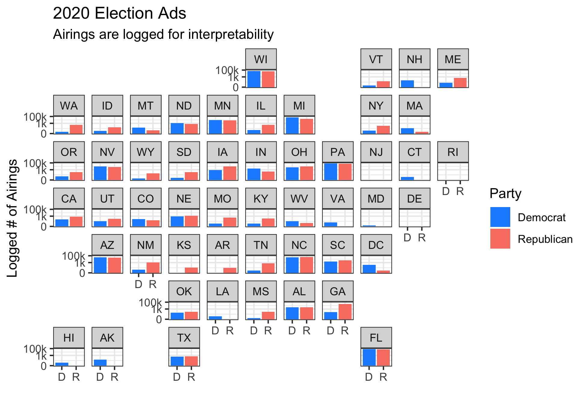
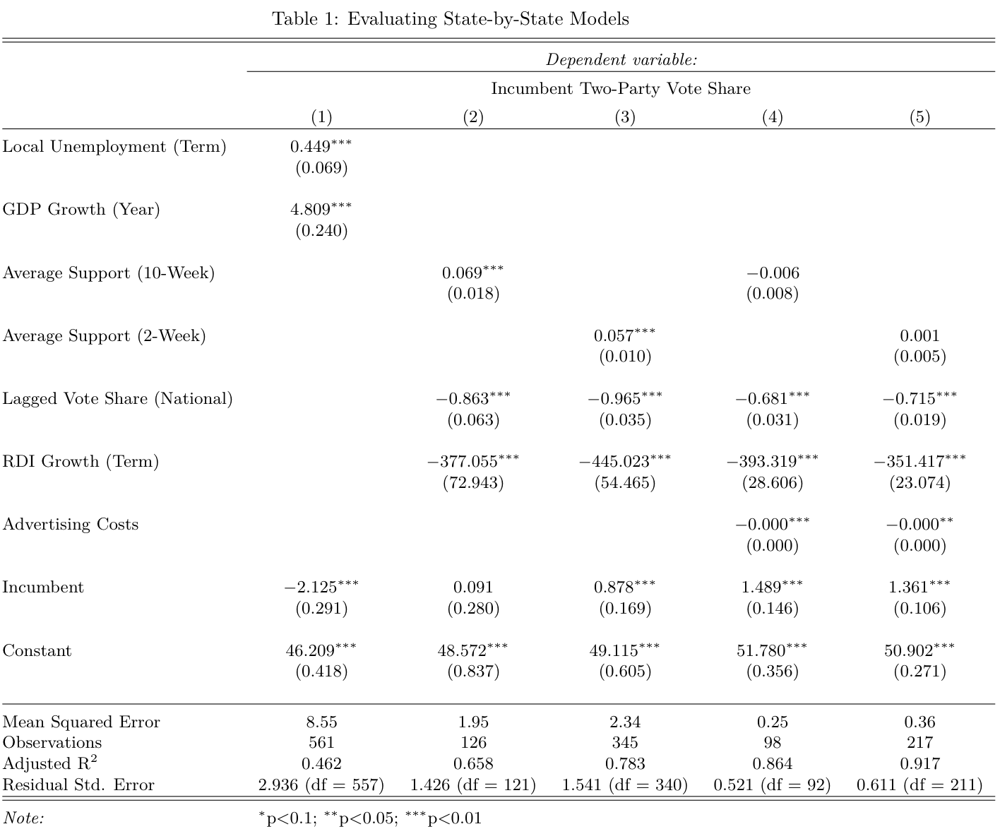
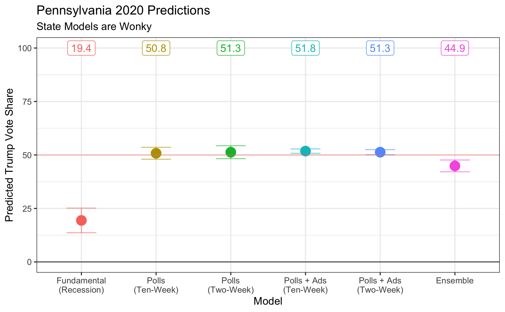

## The Air War (10.10.20)

### A Primer

This week, I examine advertising, use my national model data to predict state outcomes, and realize why combining those first two elements isn't a great idea. There was a lot of under the hood work this week, which I hope to extend in coming weeks as I transfer my linear models into probablistic ones.

For this post, I sought to answer the following questions:

(1) How widespread is advertising in non-competitive states? (Not much.)

(2) Can I transfer the data behind my national model into a state-by-state model? (Yes.)

(3) What does that model say about 2020? (Enough to make me question its validity.)

### Advertising

Election year means television ads. While campaigns have diversified into social media ads over the last decade, television advertising remains the dominant form of external messaging.

Going into this week, I was reminded of my experience during the 2012 cycle. Being from New Jersey, one of the bluest states in the country, I didn't see many television ads from either candidate. This was likely due to its safe status and the extra costs of the New York media market. However, I left New Jersey to visit family in Ohio for a week in the home stretch of the race. Every primetime program was barraged with ads from both national candidates, along with a variety of local figures. That week in Ohio helped me internalize the fact that Ohio was important in elections and New Jersey, quite simply, wasn't.

I now have advertising data to put that perception to the test. I was curious to see whether non-competitive states were seeing any advertising in September, the latest month of available data. I wrangled the data and mapped it by state (in cartographical form!), logging the number of airings to get a better picture of how non-competitive states are being targeted.

A few takeaways here:

(1) In teams of reach, **both parties appear to be placing ads in odd areas**. Trump is making a push toward traditionally blue states (Washington and New York come to mind), and Biden seems to have sprinkled a few ads around red states (ex. Louisiana and North Dakota).

(2) Overall, though, **non-competitive states have barely any ads**. Keep in mind that the y-axis is logged, so the differences only increase as the bars get larger. I had to do this so non-competitive states would show in the first place, and it is no surprise that swing states like Arizona and Florida have bars nearly reacing the top, while other states like Maryland and Idaho are struggling to reach 1,000 ads. It could be that outside groups only spend on ads in safe states when the election is very close (as a mobilizing tactic), but it could also be equally true that those groups only target competitive states. Either way, it would be very interesting to update this with data post-election.

(3) No ads yet in New Jersey. **Sad!**

### Creating Local Models

[Last week](https://jackmschroeder.github.io/Election-Analytics/Posts/week4.html) I had a pretty decent ensemble model with a mean squared error of 1.60. That was a national model, though, and local models look to be harder and potentially much noisier.

I wanted to keep the structure of my previous models:

(1) Fundamentals based model measuring term-wide unemployment, annual GDP growth, and incumbency.

(2) A polling model incorporating average support ten weeks out, lagged national vote share, term-wide change in real disposable income, and incumbency.

and (3) The same model as (2) but with two-week average support instead of ten-week.

To adapt these for each state, I changed national unemployment to local unemployment and used statewide polling instead of national polling. I also added in advertising costs dating back to 2000 to modified versions of (2) and (3), giving me five models to work with.

I fit the models, calculated mean squared error, and summarized them in the table below:

Some conclusions:

(1) Mean squared error is **very good** once advertising costs are added. The fundamentals model has an MSE of 8.55 (which is pretty horrible), but the two-week polls + ads model has a MSE of only **0.36**. This is honestly kind of alarming, since it points toward overfitting.

(2) Lagged state vote share was **not as predictive** as lagged national vote share in the models (I didn't show these models in the table, but it was still surprising).

(3) **Advertising costs are very significant**, add a lot of explanatory power to the model, but themselves have bad coefficients because of their scale. I should've rescaled them before making the models.

These three things aside, I was still very optimistic going into predicting 2020 results, with the small caveat that the extremely small MSE of the ad models was giving me a bit of pause.

### 2020 Predictions - Pennsylvania

I decided to choose the state we focused on in section (Pennsylavnia) as a test for this week's models. Pennsylvania looks to be a swing state this cycle after going for Trump in 2016. I was interested to see what my models predicted for this year.

I ran into a few problems gathering reliable 2020 data, the foremost being that the advertising data did not give costs per candidate. To approximate these, I took the share of total ads from each candidate and multiplied it to the total cost of ads in that state. I think this should be a good measure (I don't see either candidate consistently spending less than the other in a certain state), but it could be improved with better data.

I predicted each state's incumbent vote share, but I took the PA outcomes and graphed them below:

Here are the conclusions:

(1) First and foremost, **my local models have an undetermined, massive flaw**. For each polling model (with and without ads), Trump was predicted to get a voteshare between 49-52%, no exceptions. That this value never varied gives me massive trepidation before I can predict that Trump will win PA. Taking into account the very small MSE once ads were included, it's likely I **overfitted**.

(2) The **local fundamentals model is also very flawed**, but this was to be expected given the recession. Since voters still seem to think Trump is strong on the economy, I doubt that this model is accurately portraying the situation on the ground either.

(3) With these two extremes (ad models showing a narrow victory and the econ model showing a massive landslide), my **ensemble model actually ends up with a decent prediction** of a 45% Trump vote share. This is definitely within an acceptable range, but that doesn't make the fact that the local models on their own seem massively off any better.

(4) I need to hunker down next week and **determine the cause of the local models' general failure**, which could be down to *faulty data* or some miscoding on my end. However, it is also possible that these models are exposing the same **flaws in linear modeling** that we went over this week in section. Since I'm decently confident in the data I read into the models, this is just another sign that I have to move to *probabilistic modeling* soon. I hope to have this done next week, where I'll have more time to do it accurately.