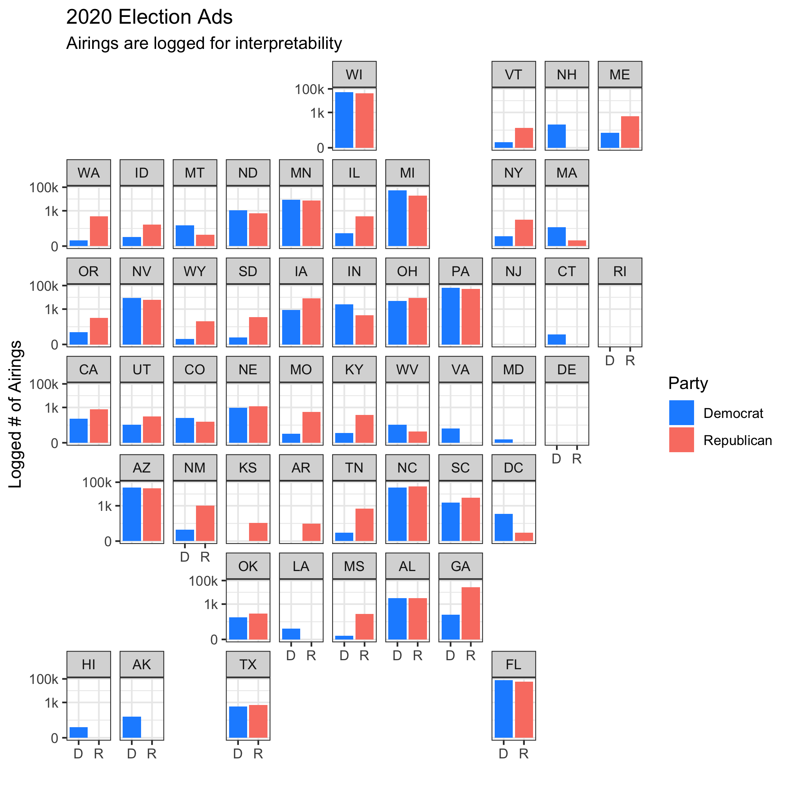

## The Air War (10.10.20)

### A Primer

This week, I examine advertising, use my national model data to predict state outcomes, and realize why combining those first two elements isn't a great idea. There was a lot of under the hood work this week, which I hope to extend in coming weeks as I transfer my linear models into probablistic ones.

For this post, I sought to answer the following questions:

(1) How widespread is advertising in non-competitive states? (Not much.)

(2) Can I transfer the data behind my national model into a state-by-state model? (Yes.)

(3) What does that model say about 2020? (Enough to make me question its validity.)

### Advertising

Election year means television ads. While campaigns have diversified into social media ads over the last decade, television advertising remains the dominant form of external messaging.

Going into this week, I was reminded of my experience during the 2012 cycle. Being from New Jersey, one of the bluest states in the country, I didn't see many television ads from either candidate. This was likely due to its safe status and the extra costs of the New York media market. However, I left New Jersey to visit family in Ohio for a week in the home stretch of the race. Every primetime program was barraged with ads from both national candidates, along with a variety of local figures. That week in Ohio helped me internalize the fact that Ohio was important in elections and New Jersey, quite simply, wasn't.

I now have advertising data to put that perception to the test. I was curious to see whether non-competitive states were seeing any advertising in September, the latest month of available data. I wrangled the data and mapped it by state (in cartographical form!), logging the number of airings to get a better picture of how non-competitive states are being targeted.

A few takeaways here:

(1) In teams of reach, both parties appear to be placing ads in odd areas. Trump is making a push toward traditionally blue states (Washington and New York come to mind), and Biden seems to have sprinkled a few ads around red states (ex. Louisiana and North Dakota).

(2) Overall, though, non-competitive states have barely any ads. Keep in mind that the y-axis is logged, so the differences only increase as the bars get larger. I had to do this so non-competitive states would show in the first place, and it is no surprise that swing states like Arizona and Florida have bars nearly reacing the top, while other states like Maryland and Idaho are struggling to reach 1,000 ads. It could be that outside groups only spend on ads in safe states when the election is very close (as a mobilizing tactic), but it could also be equally true that those groups only target competitive states. Either way, it would be very interesting to update this with data post-election.

(3) No ads yet in New Jersey. Sad!

### Creating Local Models

### 2020 Predictions - Pennsylvania

