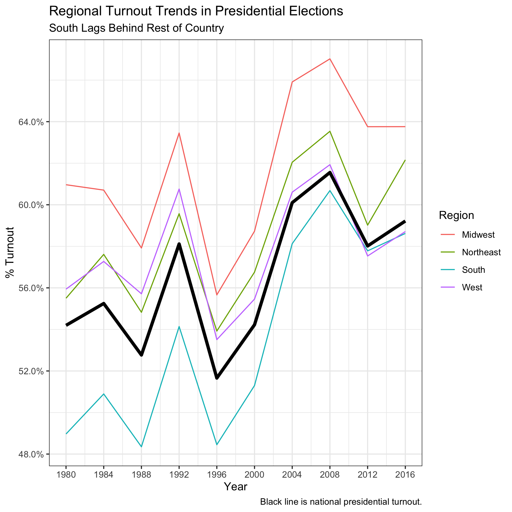

## The Ground Game (10.17.20)

### A Primer

It's getting clearer each week that I should be building a probabilistic model with accurate state-level predictions. On a non-midterm week, that is what I would be doing here. But, as with many things, life got in the way, so instead this week I will be examining turnout trends. I had three questions:

(1) How high is turnout generally? (Consistently decent.)

(2) Does this differ by election type? (Yes.)

(3) Are there any regional trends? (North > South.)

(4) What does this tell us for 2020? (It's complicated.)

### Turnout

The right to vote is important for a healthy democracy, but it does not guarantee that everyone votes. Americans care very much about having the *option* to vote, even if not all of them partake in the electoral process. Other countries do this differently; in Australia, for example, citizens can be fined for not voting.

There has also been recent emphasis on American non-voters. Most notably in 2016, campaigns have made large efforts to encourage these populations to vote for their candidate. As a result, there is a general sentiment that "outsider" candidates can best marshal non-voters in their favor. Presumably, non-voters don't vote because they are fed up with the system, so an outsider could renew their faith in the process by promising change.

A simple question arises: was 2016 all that different in voter turnout? I decided to graph voter turnout in presidential election years and midterm elections over time:

There are three takeaways:

(1) 2016 turnout wasn't particularly high at 59.2%, although it was higher than in 2012 (58%). Overall, though, only half to two-thirds of the voting eligible population votes in presidential election years. This is low!

(2) Turnout dramatically dips in midterm elections. Even though every house seat is up every 2 years, the lack of a presidential race probably lowers the implied importance of voting for most people.

(3) The grey dots are all state-level turnouts, and there seems to be massive variation in both types of elections (presidential and midterm).

That last takeaway merits a closer look. I took state-level data and plotted turnout using `geofacet`:

(1) As a whole, turnout in northern states seems to dwarf turnout in southern states in presidential elections. Turnout is dismal in midterms throughout, but still seems to be higher in the North. I will explore this more below.

(2) Midterm turnout lags behind presidential turnout pretty consistently. Still, in some small states like Hawaii, Idaho, and South Dakota, midterm turnout approaches presidential levels. Could this be the result of statewide house districts having more importance than districts in larger states?

(3) Some perennial battleground states (Florida, Ohio, etc.) have high turnout. Is this due to campaign effort, as described in Enos and Fowler (2016)? Or could there be a separate explanation?

What does turnout look like regionally? I used the four major census regions (Northeast, Midwest, South, and West) and created regional turnout metrics in election years. I compared these to national turnout in the visualization below:

A few conclusions:

(1) Turnout is indeed higher in the north (Northeast and Midwest) than in the South. There could be a variety of explanations here, including fewer competitive elections and more hurdles to voting.

(2) The West has historically outperformed the national average, but this has recently fallen.

An open question is whether there are any year-specific regional boosts. I lagged each state's turnout, computed summary statistics by region, and plotted the results:

Overall, there don't seem to be any region-specific effects in certain elections. Any differences seem to be pretty minor. The only trend seems to be lower turnout in re-election campaigns, but 2004 bucks that trend pretty significantly.

### Impact on 2020

Turnout looks to be very unpredictable in 2020. Fivethirtyeight and The Economist models.