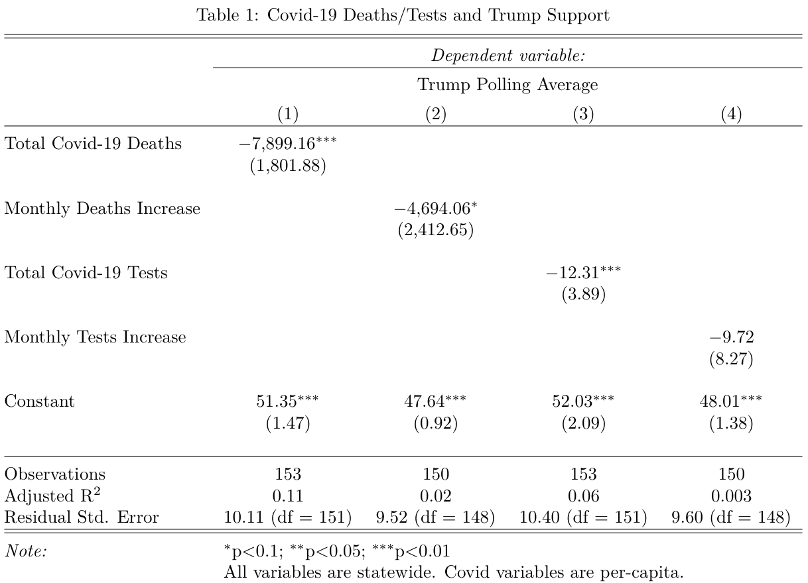
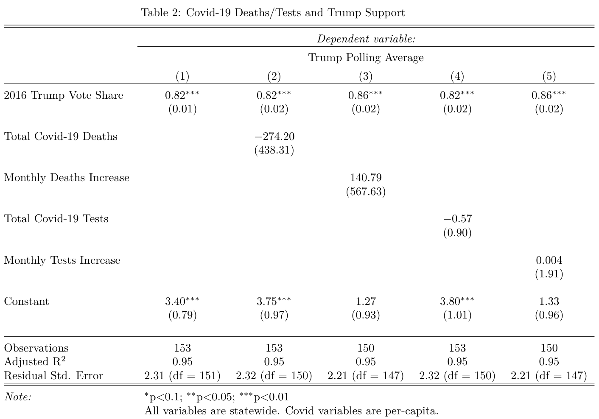

## Shocks and Covid-19 (10.24.20)

### A Primer

This week's focus was on shocks, with a particular emphasis on Covid-19. By all accounts, the pandemic has already had a massive impact on the 2020 election. But can I show this empirically? I had three questions:

(1) When did people realize there would be a partisan response to Covid? (Pretty quickly.)

(2) Has the statewide prevalence of Covid impacted Trump's standing in the polls? (At first glance, yes.)

(3) Does this relationship hold up to scrutiny? (No, but that doesn't discount the work of others.)

### Lockdown Analysis

To preface any discussion on how Covid-19 could impact voting behavior, it's necessary to look back at our behavior during the lockdowns. I was doing research with friends (Alex Norris and Gabe Cederberg) for Prof. Michael Hiscox as the pandemic forced us into quarantine. We quickly became interested in the response to lockdowns, particularly how obedience to stay-at-home orders seemed to vary across strictly partisan lines.

As we were in the early stages of lockdowns, we decided to gather mobility data from Cuebiq, a location analytics company. Since they were inundated with requests for data-sharing, we scraped results off of their public interface and applied them to the three toughest-hit states at that time: New York, New Jersey, and Connecticut (the tri-state area).

Gabe, Alex, and I were able to get measurements of Cuebiq's mobility index pre-pandemic (early January) and at the beginning of lockdowns (late March). We augmented this data with 2016 electoral results, demographic information (race, education, wealth, etc.), and other indicators that we thought would separate counties (population per square mile). We then added current Covid case/death information, although we acknowledged these to be lagging indicators at that point in the pandemic. I ran regressions with this data and found democratic vote share (by county) to be a significantly and negatively correlated with lockdown obedience (as measured by Cuebiq's overall mobility index).

There's three reasons why I wanted to bring this up:

(1) Our attempts to help explain current events with data was really enjoyable, and it was a large reason why I was attracted to this class — where we are trying to explain a future event - in the first place.

(2) We weren't alone in thinking this! Allcott et al (2020) had a working paper ready to go in early April with more robust data and regressions but the same overall finding: areas with more Republicans engage in less social distancing, even after controlling for other factors. That paper is being published next month!

(3) I created a visualization during this research that I think helps ground a discussion on Covid's impact on the election. I plotted each county's stay-at-home rating (based on Cuebiq's mobility index) against 2016 Democratic vote share and got the following:

What's the takeaway? Even in the early stages of the pandemic, we had already politicized public health. This gives us the grounding to look ahead to the election and descriptively analyze potential results.

### Electoral Impact

I decided to look at how prominent Covid metrics - deaths and tests - potentially factor into Trump's polling going into the election. This was inspired by Vavreck and Warshaw (2020)'s analysis into how county Covid deaths impacts Trump's approval rating. Although I could have used Covid metrics by county, since I can't subset my polling averages on the county level, I gathered data by state.

I redownloaded FiveThirtyEight's database of polls and sorted them into buckets based on months to the election (one bucket of polls from October 3 onward, one of polls from September 3-October 2, one of polls pre-September 3). I then got state-level data from *The COVID Tracking Project*. I calculated each major metric (deaths and tests) for per-capita totals and per-capita increases by month from the election. I lagged the monthly increases to let me see the effect of the previous month's Covid data on Trump's approval.

I regressed Trump's monthly polling average in four separate models: (1) on total per-capita deaths, (2) on the per-capita monthly increase in deaths, (3) on total per-capita tests, and (4) on the per-capita monthly increase in tests. All of these variables are statewide, and I summarized the results in the table below:

There are two takeaways:

(1) Every indicator except for the monthly increase in tests is significantly and negatively correlated with support for Trump. This is a good sign and in the expected direction (it would be weird if more deaths was associated with higher Trump support).

(2) Worryingly, though, the adjusted r-squareds are low (model 1 has the highest at 0.11) and the standard errors are high (model 3's is 10.4 points in the polling average).

Since these models are very simple, I decided to see if my concerns were valid by including 2016 Trump vote share as a control in each of the models. I ran this lagged vote share variable by itself to predict Trump's polling average, then applied lagged vote share to all four of the models:

A few conclusions:

(1) Trump's 2016 vote share explains an insane amount of the variance in his monthly polling averages. The adjusted r-squared is 0.95, which is light years ahead of the values for the earlier models.

(2) After including lagged vote share, none of the Covid variables are significant. To put it differently, no Covid indicator seems to impact Trump's polling averages independently from Trump's statewide totals from 2016.

Does this give me reason to doubt Vavreck and Warshaw (2020)? I don't think so. Instead of working with polling averages, they in-housed the polling. They also work on the county-level and generate a rolling average of Covid deaths per-capita for each respondent. The monthly figures in my model are static and do not update based on the date of each poll (since I'm working with the monthly polling average). If I re-ran my analysis by creating rolling indices of monthly support and Covid metrics, I would expect to see similar results to their work, although I would not be able to isolate anything on the county level.

### References

Allcott, H., et al. (2020). "Polarization and public health: Partisan differences in social distancing during the coronavirus pandemic." *Journal of Public Economics* 191. November 2020. Accessed online.

*The Atlantic*. (2020). "The COVID Tracking Project." Updated October 23, 2020. Accessed online.

Vavreck, L. and Warshaw, C. (2020, September 18). "How local Covid deaths are affecting vote choice." *The New York Times.* Accessed online.