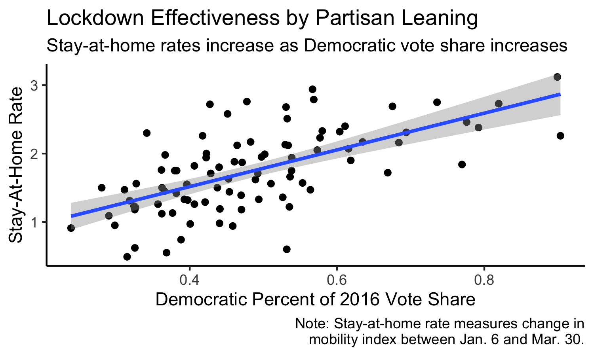

## Shocks and Covid-19 (10.24.20)

### A Primer

It's getting clearer each week that I should be building a probabilistic model with accurate state-level predictions. On a non-midterm week, that is what I would be doing here. But, as with many things, life got in the way, so instead this week I will be examining turnout trends. I had three questions:

(1) How high is turnout generally? (Consistently decent.)

(2) Does this differ by election type? (Yes.)

(3) Are there any regional trends? (North > South.)

(4) What does this tell us for 2020? (It's complicated.)

### Lockdown Analysis

To preface any discussion on how Covid could impact voting behavior, it's necessary to look back at our behavior during the lockdowns. I was doing research with friends (Alex Norris and Gabe Cederberg) for Prof. Michael Hiscox as the pandemic forced us into quarantine. We quickly became interested in the response to lockdowns, particularly how obedience to stay-at-home orders seemed to vary across strictly partisan lines.

As we were in the early stages of lockdowns, we decided to gather mobility data from Cuebiq, a location analytics company. Since they were inundated with requests for data-sharing, we scraped results off of their public interface and applied them to the three toughest-hit states at that time: New York, New Jersey, and Connecticut (the tri-state area).

Gabe, Alex, and I were able to get measurements of Cuebiq's mobility index pre-pandemic (early January) and at the beginning of lockdowns (late March). We augmented this data with 2016 electoral results, demographic information (race, education, wealth, etc.), and other indicators that we thought would separate counties (population per square mile). We then added current Covid case/death information, although we acknowledged these to be lagging indicators at that point in the pandemic. I ran regressions with this data and found democratic vote share (by county) to be a significantly and negatively correlated with lockdown obedience (as measured by Cuebiq's overall mobility index).

There's three reasons why I wanted to bring this up:

(1) Our attempts to help explain current events with data was really enjoyable, and it was a large reason why I was attracted to this class — where we are trying to explain a future event - in the first place.

(2) We weren't alone in thinking this! Allcott et al (2020) had a working paper ready to go in early April with more robust data and regressions but the same overall finding: areas with more Republicans engage in less social distancing, even after controlling for other factors. That paper is being published next month!

(3) I created a visualization during this research that I think helps ground a discussion on Covid's impact on the election. I plotted each county's stay-at-home rating (based on Cuebiq's mobility index) against 2016 Democratic vote share and got the following:

What's the takeaway? Even in the early stages of the pandemnic, we had already politicized public health. This gives us the grounding to look ahead to the election and descriptively analyze potential results.

### Electoral Impact

### References

Allcott, H., et al. (2020). "Polarization and public health: Partisan differences in social distancing during the coronavirus pandemic." *Journal of Public Economics* 191. November 2020. Accessed online.

*The Economist*. (2020). "Forecasting the US elections." Updated October 17, 2020. Accessed online.

McDonald, M. (2020). "2020 general election early vote statistics." *United States Elections Project*. Updated October 17, 2020. Accessed online.

Silver, N. (2020, August 12). "How FiveThirtyEight’s 2020 presidential forecast works — And what’s different because of COVID-19." *FiveThirtyEight*. Accessed online.